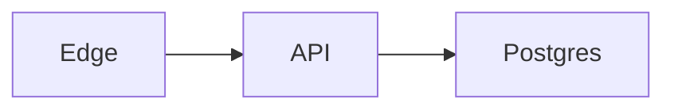

# Markdown, Code, and Document Semantics

## Canonical baseline

Lattice pages use a conservative documented dialect based on:

- CommonMark.
- GitHub Flavored Markdown.
- YAML front matter.
- Wiki-link reading and optional writing.
- Mermaid and other standard fenced code.
- A small directive syntax for embeds and structured presentation.
- Optional stable block IDs.

Rule:

> Read many dialects; write one predictable Lattice dialect.

## Page example

````markdown
---
id: 019b...
title: Deployment architecture
tags:
  - infrastructure
  - kubernetes
---

# Deployment architecture

The production environment contains three application nodes.

<!-- lattice:block 019b... -->



:::lattice-embed
resource: ../Data/Services.data/views/Active.view.yaml
height: 640
fallback: "[Open active services](../Data/Services.data/views/Active.view.yaml)"
:::
````

## Block identity

Stable block IDs enable:

- Block-level links.
- Transclusion.
- Comments.
- Precise citations.
- Agent edits with revision preconditions.
- Canvas anchoring.

IDs should be unobtrusive and optional until a block is referenced or needs collaboration identity.

## Markdown directives

Directives must remain small and documented. They should contain readable fields and fallbacks.

Use directives for:

- Resource embeds.
- Query results.
- Code references.
- Callouts when imported syntax cannot be preserved directly.
- Responsive layout hints.
- Static versus interactive export behavior.

Do not turn Markdown into arbitrary executable MDX by default.

## Rich editor model

ProseMirror/Tiptap may use a richer internal AST, but Lattice owns:

- The schema.
- Markdown parser and serializer.
- Round-trip tests.
- Migration behavior.
- Unsupported-node fallbacks.

The editor library's JSON is not the canonical file format.

## Long-page performance

- Incremental parse and serialization.
- Block virtualization for extremely long pages.
- Lazy media and embed rendering.
- Off-thread syntax highlighting where possible.
- Cached read-only render for inactive pages.
- Narrow editor state subscriptions.

## Code blocks

Normal fenced code remains valid Markdown:

````markdown
```rust title="src/main.rs" lineNumbers highlight="2-4"
fn main() {
    println!("Hello");
}
```
````

Supported presentation metadata:

- Language.
- Title/path.
- Line numbers.
- Highlighted or focused lines.
- Diff additions and deletions.
- Collapsed state.
- Code groups/tabs.
- Copy action.
- Wrap toggle.
- Open source action.
- Send to notebook.
- Run as task.

Shiki (TextMate grammars) highlights fenced code in the desktop page editor and preview via a deferred worker; `mermaid` fences skip Shiki and render diagrams instead. Tree-sitter remains the planned path for incremental structural understanding (symbols/regions), not fence coloring.

## File-backed code snippets

Documentation should reference real source instead of duplicating it:

````markdown
```rust source="../src/parser.rs" region="parse_document"
```
````

Or:

```markdown
:::lattice-code
source: ../src/parser.rs
symbol: Parser::parse_document
language: rust
:::
```

Extraction modes:

- Named symbol through Tree-sitter or language server.
- Explicit source markers.
- Line ranges as a fallback.

CI can fail when referenced regions disappear.

## Executable snippets

Execution is explicit:

````markdown
```python runnable kernel="python-local" timeout="30s"
import polars as pl
pl.DataFrame({"value": [1, 2, 3]})
```
````

A runnable block declares:

- Runtime/kernel.
- Environment.
- Capabilities.
- Inputs.
- Timeout and memory limits.
- Cache policy.
- Output handling.

Outputs may be plain text, Arrow data, image, Vega-Lite, HTML, or a proposed transaction.

## Diagrams

First-class source formats:

- Mermaid for approachable diagrams.
- Graphviz DOT for graph layouts and advanced control.
- SVG for direct vector graphics.
- BPMN and DMN for process and decision models.
- C4 or other domain conventions through plugins.

Diagrams retain source and optional cached renderings.

## Mathematics and citations

Support:

- LaTeX-style inline and display math.
- CSL JSON and citation keys.
- BibTeX and RIS import/export.
- Footnotes.
- Source anchors for PDFs and web captures.

## Document views

A page can render as:

- Flow document.
- Focus mode.
- Paginated print preview.
- Presentation/slide sequence.
- Canvas frame.
- Published documentation page.
- Linear mobile reading view.

The Markdown remains the source.

## Quick-note mode

Quick note is a dedicated fast application entry point:

- One Markdown file.
- Minimal editor bundle.
- No canvas, DuckDB, charts, plugins, or notebook load before editing.
- Atomic save and recovery journal.
- Optional inbox target.
- Command-line launch.

```bash
lattice note
lattice open README.md
lattice scratch
```

## Import/export

Pandoc or adapters can convert to and from DOCX, ODT, EPUB, Typst, LaTeX, OPML, Jira markup, and other formats. Conversions are structural and may be lossy; Lattice must report unsupported features rather than imply perfect round trips.
