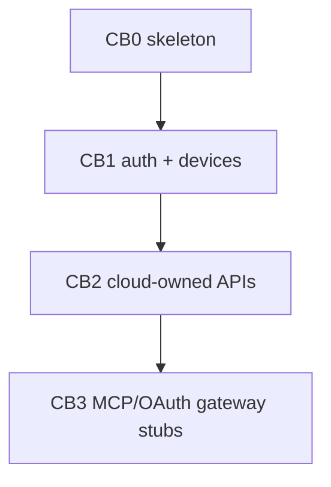

# Cloud backend hackathon DAG

**Moved (2026-07-27):** implementation now lives in private
[`lattice-ecosystem`](https://github.com/willmortimer/lattice-ecosystem)
(`apps/server`, `crates/lattice-cloud`, `infra/cloud`). This document remains
as historical planning context for the public client.

**Status:** CB0–CB3 merged into BASE (`08575c1`)  
**BASE branch:** `feat/cloud-backend`  
**BASE worktree:** `.worktrees/feat-cloud-backend`  
**Domain:** https://lattice-notes.com (Cloudflare)  
**Last updated:** 2026-07-24

## Problem / end state

Stand up a self-hostable Rust cloud backend (`lattice-server` + `lattice-cloud`)
that supports passkey login, device enrollment, share/publish/backup APIs, and
stub remote MCP/OAuth discovery — without requiring CellHostOS.

Falsifiable demo:

1. Open static auth page → register passkey → login.
2. Enroll a device → `GET /v1/me` returns user + devices.
3. Create workspace → share token / publish upload / opaque backup PUT work.
4. `POST /mcp` lists cloud tools; workspace read/propose tools return
   `authority_offline` / `not_routable`.

## Decisions (locked)

| Topic | Choice |
|---|---|
| Layout | `crates/lattice-cloud` lib + thin `apps/server` (`lattice-server`) |
| Auth UI | Static WebAuthn page served by `lattice-server` |
| Account auth | Passkeys only (no password) for v0 |
| WebAuthn RP ID | `lattice-notes.com` |
| WebAuthn origin | Env `LATTICE_WEBAUTHN_ORIGIN` (prod default `https://cloud.lattice-notes.com`; lab may use tunnel URL) |
| Storage | SQLite metadata + filesystem object root (ADR 0013 self-hosted mode) |
| Out of scope | Cell lifecycle, full sync/CRDT, Code Mode, desktop Settings UI, agentd |

## Base branch policy

- Integration branch / BASE: `feat/cloud-backend`
- Primary desktop checkout stays on `friday/integration` (do not disturb)
- Each task uses an isolated worktree branching from current BASE tip
- Merge each completed task into `feat/cloud-backend` before launching dependents

## DAG overview

## Model assignments

| Task | Model | Why |
|---|---|---|
| CB0 | `composer-2.5` | Routine crate/binary scaffolding |
| CB1 | `cursor-grok-4.5-high` | WebAuthn/session/device security design |
| CB2 | `composer-2.5` | CRUD + object store following CB1 patterns |
| CB3 | `composer-2.5` | Gateway stubs over existing APIs |
| Parent review | this session | Merge, smoke, acceptance |

## Merge / validation order

1. Merge CB0 → BASE; `cargo check -p lattice-server`
2. Merge CB1 → BASE; auth smoke (register/login/device/me)
3. Merge CB2 → BASE; API tests for share/publish/backup
4. Merge CB3 → BASE; MCP initialize + tools/list
5. Final: `cargo test -p lattice-cloud` and focused server tests

---

## Task handoff packets

### Task `CB0`: skeleton

- **Problem:** No `lattice-server` / `lattice-cloud` exists; later slices need a place to land.
- **Solution:**
  - Add `crates/lattice-cloud` library crate and `apps/server` binary named `lattice-server`.
  - Wire workspace `Cargo.toml` members + path deps.
  - Config from env; SQLite data dir + object root paths reserved; `GET /healthz`.
  - Minimal architecture stub doc already at this path — extend only if needed.
- **Implement:**
  1. Create crate/binary following existing `apps/daemon` / crate patterns (edition, license, workspace deps).
  2. Axum router with `GET /healthz` → `{"ok":true,"service":"lattice-server"}`.
  3. Config struct: `listen`, `data_dir`, `object_root`, `webauthn_rp_id`, `webauthn_origin`, `bootstrap_token`.
  4. Defaults: listen `127.0.0.1:8788`, data dir under `data_dir` (create on start), RP ID `lattice-notes.com`.
  5. Unit/smoke test: healthz via tower/axum test or `#[tokio::test]`.
  6. Do **not** implement auth, MCP, or cloud APIs yet.
- **End state:**
  - `cargo test -p lattice-cloud` and `cargo test -p lattice-server` pass (or server tests in cloud crate if binary is thin).
  - `cargo run -p lattice-server` serves healthz.
- **Depends on:** none
- **Subagent type / model:** `generalPurpose` / `composer-2.5`
- **Effort / scope bound:** scaffolding only; no WebAuthn, no schema migrations beyond empty placeholder module OK.
- **Return:** summary, diff stats, test commands+results, risks

### Task `CB1`: auth + devices

- **Problem:** Cloud APIs and MCP need authenticated users and enrolled devices.
- **Solution:**
  - Passkey register/login (WebAuthn) with bootstrap gate for first user.
  - Opaque server-side sessions (token hash in SQLite).
  - Device enrollment with public key + name after session auth.
  - Static HTML/JS auth page using `navigator.credentials`.
  - `GET /v1/me` returns user + devices.
- **Implement:**
  1. Schema: `users`, `passkeys`, `sessions`, `devices` (+ migration runner).
  2. Prefer `webauthn-rs` (or justify alternative) with RP ID `lattice-notes.com`.
  3. Routes:
     - `GET /auth/` static page
     - `POST /v1/auth/register/start|finish`
     - `POST /v1/auth/login/start|finish`
     - `POST /v1/auth/logout`
     - `GET /v1/me`
     - `POST /v1/devices`, `GET /v1/devices`
  4. Bootstrap: if no users, require `LATTICE_BOOTSTRAP_TOKEN` header/body on register start.
  5. Session: `Authorization: Bearer <token>` or httpOnly cookie; document choice in module docs.
  6. Tests: in-memory or temp-dir SQLite covering register→login→enroll→me (mock WebAuthn if needed; at minimum session+device paths tested).
- **End state:** Automated tests green; manual steps documented for real Touch ID against configured origin.
- **Depends on:** CB0 merged into BASE
- **Subagent type / model:** `generalPurpose` / `cursor-grok-4.5-high`
- **Effort / scope bound:** No share/publish/backup/MCP. No OAuth AS. No desktop UI.
- **Return:** summary, diff stats, test commands+results, how to run static page, risks

### Task `CB2`: cloud-owned APIs

- **Problem:** Hackathon needs visible share/publish/backup without full sync.
- **Solution:**
  - Workspace registry owned by authenticated user.
  - Share tokens; public `GET /s/:token`.
  - Publish upload under object root; public URL path.
  - Opaque backup ciphertext PUT + metadata list; server never decrypts.
  - `audit_events` for mutating cloud actions.
- **Implement:**
  1. Schema: `workspaces`, `shares`, `publishes`, `backups`, `audit_events`.
  2. Authn required except public share/publish GET.
  3. APIs (REST, JSON):
     - workspaces CRUD (minimal: create/list/get)
     - `POST /v1/workspaces/:id/shares` → token
     - `GET /s/:token` → read-only snapshot or redirect to publish
     - `POST /v1/workspaces/:id/publishes` (multipart or tarball upload)
     - `GET /p/:slug` public publish
     - `PUT /v1/workspaces/:id/backups` ciphertext + metadata
     - `GET /v1/workspaces/:id/backups` metadata only
  4. Object store: files under `{object_root}/…`; no S3 required.
  5. Tests for happy paths + unauthorized rejection.
- **End state:** cargo tests prove share/publish/backup metadata flows.
- **Depends on:** CB1 merged into BASE
- **Subagent type / model:** `generalPurpose` / `composer-2.5`
- **Effort / scope bound:** No client-side encryption implementation beyond accepting ciphertext bytes; no CF Pages deploy; no sync outbox.
- **Return:** summary, diff stats, test commands+results, risks

### Task `CB3`: MCP / OAuth gateway stubs

- **Problem:** Remote MCP clients need discovery endpoints and a tool surface.
- **Solution:**
  - Stub OAuth protected-resource (+ optional AS 501).
  - `POST /mcp` JSON-RPC: `initialize`, `tools/list`, `tools/call` for cloud tools wired to CB2.
  - Workspace authority tools return structured `authority_offline` / `not_routable`.
- **Implement:**
  1. `GET /.well-known/oauth-protected-resource`
  2. `GET /.well-known/oauth-authorization-server` → 501 or minimal stub
  3. MCP tools: `workspace.share`, `workspace.publish`, `workspace.backup_list`, `workspace.backup_put` (names may match REST)
  4. Stub tools: `workspace.read`, `workspace.propose` → offline/not_routable error payload
  5. Auth: Bearer session for tools/call; document demo PAT if needed
  6. Tests for initialize + tools/list + one cloud tool call + offline tool error
- **End state:** MCP stub usable behind future cloudflared URL.
- **Depends on:** CB2 merged into BASE
- **Subagent type / model:** `generalPurpose` / `composer-2.5`
- **Effort / scope bound:** No device tunnel, no Code Mode, no full OAuth AS.
- **Return:** summary, diff stats, test commands+results, risks
