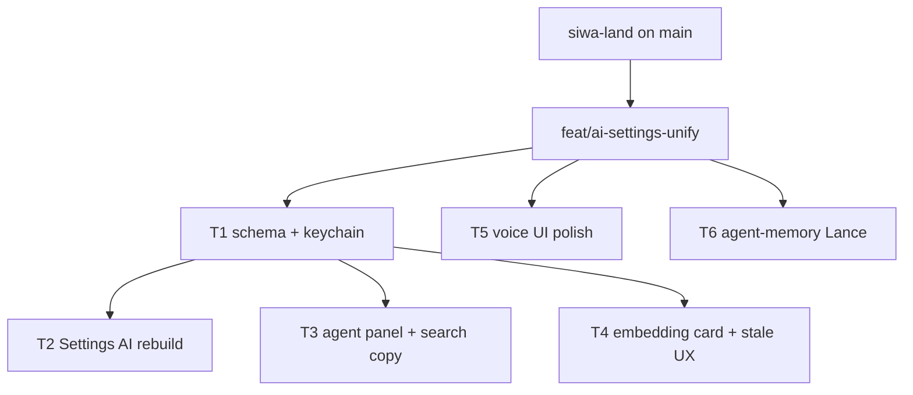

# AI settings unify DAG

Parent orchestrates; Composer 2.5 / Grok 4.5 subagents execute in isolated
worktrees. Integration branch: `feat/ai-settings-unify` off `main` after SIWA
lands.

## Problem / end state

Unify optional downloadable “packs” and AI modes under Settings → AI:

- Modes: **Local (Apple-native / local Qwen)**, **BYO OpenAI**, **Account stub**
  (Lattice cloud → OpenAI project key later; **not** long-term Pioneer)
- Profile fields: `AiMode`, `EmbeddingMode`, passive embedding flags
- Keychain for BYO OpenAI token (not env-only for desktop)
- Agent panel consumes profile config; search tool copy says hybrid/FTS correctly
- Embedding card + passive controls + explicit Lance-stale UX
- Voice UI polished and grouped as an optional pack under AI
- Agent-memory Lance dataset behind latticed tools
- `chunk_vectors` already removed on `main` (`d0144ef`) — skip

## Base branch policy

1. Land SIWA (+ separate agentd tool-loop) on **`main`**
2. Create **`feat/ai-settings-unify`** from that `main`
3. Each DAG task worktree branches from the integration branch at launch;
   merge into `feat/ai-settings-unify` before launching dependents

## DAG overview

Wave A (parallel after FEAT): T1, T5, T6  
Wave B (after T1 merged): T2, T3, T4

## Model assignments

| Task | Model | Notes |
|------|-------|-------|
| SIWA land | parent | Fix + commit on primary |
| T1 schema/keychain | `composer-2.5` | Contract for later UI |
| T5 voice polish | `cursor-grok-4.5-high` | Small UI + copy |
| T6 agent-memory | `composer-2.5` | Backend + tools |
| T2 Settings AI | parent taste review; `cursor-grok-4.5-high` impl | UX-sensitive |
| T3 agent panel | `composer-2.5` | Wire config + tool copy |
| T4 embedding card | `cursor-grok-4.5-high` | UI + status copy |

## Per-task handoffs

### Task `siwa`: Land SIWA on main

- **Problem:** Uncommitted SIWA/cloud/signing work blocks a clean feat branch.
- **Solution:** Add `.gitignore` for Swift `.build`; fix weak nonce; commit SIWA
  set only; separate commit for agentd tool-loop.
- **End state:** `main` has SIWA; dirty tree clear of SIWA/agentd; feat branch
  can fork cleanly.
- **Out:** AI settings work.

### Task `T1`: Schema + settings model + keychain

- **Problem:** No `AiMode` / `EmbeddingMode` / passive flags; AI keys are env-only.
- **Solution:**
  - Add `ai` section to Rust `DesktopSettings` + TS `DesktopSettings`
  - Enums: `AiMode = local | byo_openai | account`; `EmbeddingMode` follows or
    `follow_ai | local | remote` (prefer `follow_ai` default)
  - Passive flags: e.g. `passiveEmbeddingEnabled`, `embedOnIdle` (names match
    existing semantic patterns; keep `search.semanticEnabled` working via
    migration/compat)
  - Keychain service for BYO OpenAI API key (mirror cloud session / connectors
    SecItem patterns); Tauri commands set/get/clear presence (never echo secret
    to React beyond masked/boolean)
  - Spawn env for latticed/agentd reads keychain when mode is byo_openai
- **Key files:** `crates/lattice-profile/src/settings.rs`,
  `apps/desktop/src/lib/profile.ts`, keychain helpers under cloud-client or
  connectors, `apps/desktop/src-tauri/src/{agent,semantic}.rs`
- **End state:** Unit tests for YAML round-trip; key presence API; no Pioneer as
  primary mode in schema (env Pioneer may remain transitional).
- **Depends on:** feat branch exists
- **Out:** Full Settings UI (T2); agent panel wiring (T3)

### Task `T2`: Settings → AI rebuild

- **Problem:** AI UX split across Search / Voice / Cloud / agent header.
- **Solution:** New Settings → **AI** section: Local / BYO OpenAI / Account
  (stub). Downloadable pack affordances. Move voice + embedding entry points
  under AI; keep Search semantic toggle linked or relocated per T4.
- **End state:** One AI settings composition; Account shows stub CTA to cloud
  sign-in; Local and BYO functional against T1 model.
- **Depends on:** T1 merged
- **Taste:** Follow desktop design system; avoid generic AI purple dashboard.

### Task `T3`: Agent panel + search tool copy

- **Problem:** Panel ignores profile AI mode; Rust search tool says “FTS only”.
- **Solution:** Agent panel defaults from `ai.mode` / model prefs; BYO uses
  keychain key; fix `crates/lattice-agentd/src/tools.rs` (+ mcp-catalog if
  needed) description to hybrid/FTS.
- **Depends on:** T1 merged
- **Out:** Full Settings chrome (T2)

### Task `T4`: Embedding card + passive + Lance stale UX

- **Problem:** Embedding controls live under Search; Lance stale is generic
  “Indexing…”.
- **Solution:** Embedding card under AI; wire passive flags; when
  `vectors_behind` / stale, show explicit “vectors behind workspace” + action.
- **Depends on:** T1 merged
- **Coordinate:** Avoid fighting T2 for the same Settings sections — T2 owns
  shell; T4 owns embedding card content. If T2 not merged yet, implement card
  component + wire into existing Search section with clear TODO to relocate.

### Task `T5`: Voice UI polish

- **Problem:** Voice settings feel disconnected; pack download UX uneven.
- **Solution:** Polish VoiceDictationSettings copy/layout; align with pack
  download pattern; do **not** rewrite FluidAudio harness (separate later).
- **Depends on:** feat branch (parallel with T1)
- **Out:** Harness/FluidAudio runtime fixes

### Task `T6`: Agent-memory Lance

- **Problem:** Architecture names `agent-memory.lance`; not implemented.
- **Solution:** Path helpers + `EmbeddedLanceStore` (or sibling) table
  `agent-memory`; latticed HTTP/tools for remember/recall (consent-light stub
  ok); agentd tool wrappers calling latticed only.
- **Key refs:** `docs/architecture/lance-data-platform.md`,
  `crates/lattice-lance`, `crates/lattice-index` patterns, `lattice-agentd` tools
- **Depends on:** feat branch (parallel with T1)
- **Out:** Full multimodal extractors; eval traces

## Merge / validation order

1. SIWA → main
2. agentd tool-loop → main (separate)
3. Create `feat/ai-settings-unify`
4. Merge T1, T5, T6 as each passes review
5. Merge T2, T3, T4 after T1
6. Parent smoke: profile round-trip, settings AI section loads, search tool
   string, agent-memory path test — no full desktop rebuild required unless a
   task demands it
