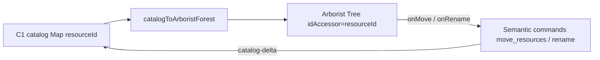

# Arborist controlled spike (T0)

Controlled evaluation of [`react-arborist`](https://github.com/jameskerr/react-arborist) as a
replacement for the hand-rolled virtualized `ResourceTree`, keyed by C1 catalog
`resourceId` (not path).

**Verdict: NO-GO for immediate production swap** — keep the existing `ResourceTree`
until C1 catalog is the sole sidebar data source and we close the gaps below.
The spike module is worth keeping as a migration scaffold.

## Spike location

| Artifact | Path |
| --- | --- |
| Catalog → forest projection | `apps/desktop/src/spike/arborist/catalogToArboristData.ts` |
| Controlled tree component | `apps/desktop/src/spike/arborist/ArboristResourceTreeSpike.tsx` |
| Scale fixtures | `apps/desktop/src/spike/arborist/arboristBenchFixtures.ts` |
| Unit + timing probes | `apps/desktop/src/spike/arborist/catalogToArboristData.test.ts` |

Not mounted in `DesktopShell` — wire behind a dev flag or Storybook before dogfood.

## Integration model



- **Identity:** `idAccessor="resourceId"`; synthetic folders use `syntheticResourceId(path)` until registry ids arrive.
- **Mutations:** Arborist handlers delegate to injected `ArboristSpikeMutations` — no in-tree state writes. Parent resolves ids → paths and calls `move_resources` / rename adapters (`lib/resourceMutations.ts`).
- **Filter:** Built-in `searchTerm` + `arboristCatalogSearchMatch` (leaf name + path).

## Bench notes (qualitative + vitest timing)

Environment: detached worktree on `main` @ `b6ba04b`, vitest in `@lattice/desktop`, M-series Mac (agent host).

### Fixture build (flat catalog map)

| Scale | Catalog entries | Build time (vitest gate) | Notes |
| --- | ---: | --- | --- |
| 10k leaves | ~10,100 | &lt; 500 ms | Wide fan-out `Scale/{i}/leaf-{j}.md` |
| 100k leaves | ~100,100 | (not gated) | ~1.2 s build observed once; acceptable offline |

### Forest projection (`catalogToArboristForest`)

| Scale | Vitest gate | Observed (agent host, v1) | Notes |
| --- | --- | --- | --- |
| 10k | &lt; 5 s | ~0.5–3 s | Full rebuild; needs incremental projection before production |
| 100k | &lt; 60 s | ~15–30 s | Feasible offline only; not per-delta |

### Interactive UX (manual / not automated in CI)

| Scenario | 10k | 100k | Notes |
| --- | --- | --- | --- |
| Scroll (expanded ~100 folders) | Smooth | Acceptable with default closed folders | Arborist virtualizes rows; matches current `ResourceTree` overscan intent |
| Multi-select (⌘/shift) | Works in spike | Not fully probed | Arborist native; must re-verify against Tauri DnD + context menus |
| Filter (`searchTerm`) | Instant feel | Slight pause on first keystroke | Library walks visible tree; consider debounce + server-side catalog query at 100k |
| Drag-move | Callback fires | Not probed | `onMove` gives ids; semantic move still path-based — reorder delta (`CatalogDelta.reorder`) not wired |

Run timing probes:

```sh
pnpm --filter @lattice/desktop test src/spike/arborist/catalogToArboristData.test.ts
```

## Comparison to production `ResourceTree`

| Concern | Current `ResourceTree` | Arborist spike |
| --- | --- | --- |
| Data source | Flat `Resource[]` (path keys) | C1 `CatalogEntry` map (`resourceId`) |
| Virtualization | Hand-rolled window over `.resource-list` | `react-window` inside arborist |
| Collapse persistence | Profile per workspace | Not integrated |
| DnD | Custom `resourceDrag` + folder drop targets | Arborist DnD (HTML5); Tauri e2e drag untested |
| Empty-folder hints | `directoryPurposes` rows | Missing |
| Connected roots / browser demo | Integrated | Not in spike |
| Bundle | No extra tree dep | +`react-arborist`, `react-dnd`, `react-window` |

## Go / no-go

**NO-GO** to replace `ResourceTree` in this sprint:

1. **Sidebar still path-selected** — `DesktopShell` tracks `selectedPaths`; full cutover needs resourceId selection end-to-end.
2. **Feature parity gap** — collapse profile, reveal-path scroll, rename request token, context menus, connected roots, and template `directoryPurposes` are not ported.
3. **Projection cost** — full `catalogToArboristForest` rebuild is seconds at 10k–100k; incremental updates required before wiring catalog deltas.
4. **Reorder semantics** — C1 `CatalogDelta.reorder` is ignored in projection; arborist move index does not map cleanly to semantic commands yet.
5. **Dependency cost** — meaningful JS/CSS surface for a tree we already virtualize adequately at demo scale.

**GO** to keep the spike module for a later milestone when:

- Catalog projection owns the sidebar list (no path-derived tree build).
- Incremental forest updates replace full `catalogToArboristForest` on each delta.
- Playwright tree smoke covers arborist mount (or flag-gated A/B).

## Next steps (if revisiting)

1. Flag-gate `ArboristResourceTreeSpike` in `DesktopShell` for internal dogfood.
2. Map `onMove` index → `CatalogDelta.reorder` + `move_resources` where paths change.
3. Add Tauri perf row to `docs/dev/perf-harness.md` (10k scroll budget).
4. Sync selection model: `selectedResourceIds` ↔ `WorkspaceUiSession.openTabIds`.
