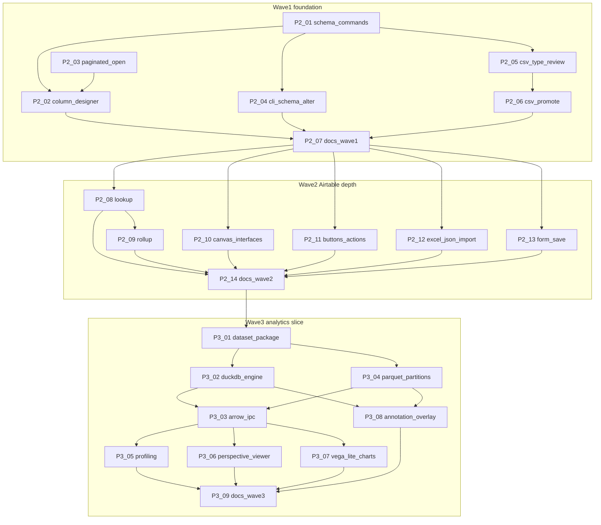

# Data Apps + Analytics Subagent DAG

**Status:** Active  
**Created:** 2026-07-19  
**BASE:** `main` @ `9c5694b`  
**Integration branch:** `feat/data-apps-and-analytics`  
**Subagent models:** `composer-2.5` (routine) · `cursor-grok-4.5-high` (architecture)  
**Parent:** plans, reviews diffs, merges; design/taste nodes stay in-loop.

Wave 1 packets were previously drafted in
[phase2-tables-wave1-dag.md](phase2-tables-wave1-dag.md); this file is the
canonical tracker for Waves 1–3.

## Problem / end state

Phase 2 has a demo-grade vertical slice (`.data` SQLite, Glide grid, six
layouts, relations, package forms, CSV import, CLI CRUD) but is not yet an
Airtable/Notion alternative. Phase 3 is spec-only.

**Done when:**

1. **Wave 1** — schema-via-commands, column designer, paginated open, CSV
   type-review / promote.
2. **Wave 2** — Lookup/Rollup, canvas interfaces, buttons, Excel/JSON import,
   FormSave.
3. **Wave 3** — DuckDB, Parquet datasets, Arrow IPC, Perspective, Vega-Lite,
   profiling, annotation overlays (vertical slice; not full BI).

## Defaults (locked)

| Decision | Choice |
|---|---|
| BASE | `main` tip at branch creation |
| Integration | `feat/data-apps-and-analytics` |
| Isolation | `best-of-n-runner` worktrees; merge after parent review |
| Phase 3 viewers | Perspective (analytical grid) + Vega-Lite (charts) |
| Out of DAG | MCP dataset writes, GeoParquet/MapLibre, query profiler UI, IronCalc |

## DAG overview

## Waves

1. **Wave A:** P2-01 ‖ P2-03
2. **Wave B:** P2-02 ‖ P2-04 ‖ P2-05
3. **Wave C:** P2-06 → P2-07
4. **Wave D:** P2-08 ‖ P2-10 ‖ P2-11 ‖ P2-12 ‖ P2-13 → P2-09 → P2-14
5. **Wave E:** P3-01 → P3-02 ‖ P3-04 → P3-03
6. **Wave F:** P3-05 ‖ P3-06 ‖ P3-07 ‖ P3-08 → P3-09

## Task status

| ID | Status | Model | Notes |
|---|---|---|---|
| P2-01 | pending | grok | Schema commands |
| P2-03 | pending | grok | Paginated open |
| P2-02 | pending | composer | Column designer |
| P2-04 | pending | composer | CLI schema alter |
| P2-05 | pending | composer | CSV type-review |
| P2-06 | pending | composer | CSV promote |
| P2-07 | pending | composer | Docs wave 1 |
| P2-08 | pending | grok | Lookup |
| P2-09 | pending | grok | Rollup |
| P2-10 | pending | grok | Canvas interfaces |
| P2-11 | pending | composer | Buttons/actions |
| P2-12 | pending | composer | Excel/JSON import |
| P2-13 | pending | composer | FormSave |
| P2-14 | pending | composer | Docs wave 2 |
| P3-01 | pending | composer | Dataset package |
| P3-02 | pending | grok | DuckDB |
| P3-03 | pending | grok | Arrow IPC |
| P3-04 | pending | grok | Parquet partitions |
| P3-05 | pending | composer | Profiling |
| P3-06 | pending | grok | Perspective |
| P3-07 | pending | composer | Vega-Lite |
| P3-08 | pending | grok | Annotation overlay |
| P3-09 | pending | composer | Docs wave 3 |

## Shared-file conflict map (Wave 1)

| File | Owners |
|---|---|
| `crates/lattice-commands/src/{command,engine,tests}.rs` | P2-01 only in Wave A |
| `apps/desktop/src-tauri/src/data.rs` | P2-01 (CSV), P2-03 (open/DTO) |
| `apps/desktop/src/data/DataTableView.tsx` | P2-02 |
| `apps/cli/src/main.rs` | P2-04 (P2-01 may rewire import) |
| `apps/desktop/src/data/types.ts` | P2-03 then P2-02 |

## Per-task handoff packets

### Task `P2-01`: Semantic schema commands

- **Problem:** `add_columns` / `add_table` bypass the command engine; CSV import cannot obey ADR 0007.
- **Solution:** Add `SemanticCommand` variants for table/column add; apply + undo with package revision guards; route Tauri/CLI CSV import through commands.
- **Implement:** `crates/lattice-commands/src/{command,engine,tests}.rs`; Tauri `import_csv_table` and CLI import paths; touch `lattice-data` only if undo needs snapshots.
- **End state:** Unit tests for add column/table undo; CSV import uses commands; `cargo test -p lattice-commands -p lattice-data` passes.
- **Depends on:** none · **Model:** cursor-grok-4.5-high
- **Out:** UI, pagination, new field types, FormSave

### Task `P2-03`: Paginated open contract

- **Problem:** `open_data_app` always materializes ≤500 rows.
- **Solution:** Extend open with `limit` + `offset`; return total/has_more; default preserves current behavior.
- **Implement:** `apps/desktop/src-tauri/src/data.rs`, `apps/desktop/src/data/types.ts`, Tauri tests. Do not rewrite Glide.
- **End state:** Windowed fetch works; callers without params still get ≤500.
- **Depends on:** none · **Model:** cursor-grok-4.5-high
- **Out:** Infinite-scroll polish, DuckDB/Arrow
- **Conflict note:** Own open/snapshot DTO only; leave CSV import section to P2-01

### Task `P2-02`: Column designer UI

- **Problem:** Users cannot add typed columns from the desktop.
- **Solution:** Toolbar to add column (name, type, optional relation); invoke P2-01 commands; show N of M / load more from P2-03.
- **Implement:** `DataTableView.tsx` (+ sibling component), Tauri wrappers if needed, minimal CSS.
- **End state:** Create table → add column → cell edit works.
- **Depends on:** P2-01, P2-03 · **Model:** composer-2.5

### Task `P2-04`: CLI schema alter

- **Problem:** CLI cannot add columns/tables after create.
- **Solution:** `lattice table add-column` / `add-table` calling P2-01 commands.
- **Implement:** `apps/cli/src/main.rs`, `apps/cli/tests/cli.rs`
- **Depends on:** P2-01 · **Model:** composer-2.5

### Task `P2-05`: CSV import profiling

- **Problem:** CSV import commits without type review.
- **Solution:** Desktop confirmation with editable inferred types; commit via P2-01 + RecordInsert. CLI stays non-interactive (optional `--type` flags).
- **Depends on:** P2-01 · **Model:** composer-2.5 · **Out:** Excel/JSON

### Task `P2-06`: CSV preview promote

- **Problem:** `CsvTablePreview` is read-only.
- **Solution:** “Create table from CSV…” reusing P2-05 commit path.
- **Depends on:** P2-05 · **Model:** composer-2.5

### Task `P2-07`: Docs Wave 1

- Update `docs/10-data-applications-and-airtable-model.md` and `docs/dev/first-look-demo.md` for Wave 1 behavior.
- **Depends on:** P2-02, P2-04, P2-06 · **Model:** composer-2.5

### Task `P2-08`: Lookup fields

- Add `FieldType::Lookup`; resolve at read time; display in grid/detail.
- **Depends on:** P2-07 · **Model:** cursor-grok-4.5-high · **Out:** Formula, cross-package

### Task `P2-09`: Rollup fields

- Add `FieldType::Rollup` (count/sum/min/max over relation).
- **Depends on:** P2-08 · **Model:** cursor-grok-4.5-high

### Task `P2-10`: Canvas interfaces

- Minimal `interfaces/*.interface.yaml`; open from canvas; demo CRM ships one.
- **Depends on:** P2-07 · **Model:** cursor-grok-4.5-high

### Task `P2-11`: Buttons / actions

- YAML actions + toolbar/row button via semantic commands.
- **Depends on:** P2-07 · **Model:** composer-2.5

### Task `P2-12`: Excel / JSON import

- `.xlsx` / `.json`/`.jsonl` into type-review → commit pipeline.
- **Depends on:** P2-07 · **Model:** composer-2.5

### Task `P2-13`: FormSave designer

- In-app form designer writing `forms/*.form.yaml` via semantic command.
- **Depends on:** P2-07 · **Model:** composer-2.5

### Task `P2-14`: Docs Wave 2

- Update docs/10 + first-look for Wave 2 features.
- **Depends on:** P2-08…P2-13 · **Model:** composer-2.5

### Task `P3-01`: Dataset package skeleton

- `crates/lattice-datasets`; `Usage.dataset/` layout; CLI create/show; desktop placeholder.
- **Depends on:** P2-14 · **Model:** composer-2.5

### Task `P3-02`: Native DuckDB engine

- `crates/lattice-duckdb`; workspace path allowlist; CLI query.
- **Depends on:** P3-01 · **Model:** cursor-grok-4.5-high

### Task `P3-03`: Arrow batch transport

- Bounded Arrow IPC Rust → desktop for analytical queries (ADR 0021).
- **Depends on:** P3-02, P3-04 · **Model:** cursor-grok-4.5-high

### Task `P3-04`: Parquet partitions + manifests

- Partitioned `facts/` Parquet; dataset.yaml manifest; CSV→Parquet helper.
- **Depends on:** P3-01 · **Model:** cursor-grok-4.5-high

### Task `P3-05`: Analytical profiling

- DuckDB-backed profile panel over dataset relation.
- **Depends on:** P3-03 · **Model:** composer-2.5

### Task `P3-06`: Perspective analytical viewer

- Perspective fed by Arrow batches for `dataset` kind.
- **Depends on:** P3-03 · **Model:** cursor-grok-4.5-high

### Task `P3-07`: Vega-Lite charts

- Chart resource / dataset binding: query → Arrow → Vega-Lite render.
- **Depends on:** P3-03 · **Model:** composer-2.5

### Task `P3-08`: SQLite annotation overlays

- `annotations.sqlite` + DuckDB JOIN with Parquet facts.
- **Depends on:** P3-02, P3-04 · **Model:** cursor-grok-4.5-high

### Task `P3-09`: Docs Wave 3

- Update docs/11, docs/13, roadmap Phase 3 status notes.
- **Depends on:** P3-05…P3-08 · **Model:** composer-2.5

## Explicit non-goals

- Phase 4 MCP/HTTP dataset mutations
- GeoParquet / MapLibre / query profiler UI
- Replacing Glide with Perspective for mutable `.data` apps
- Voice / semantic-search / daemon work on this branch
