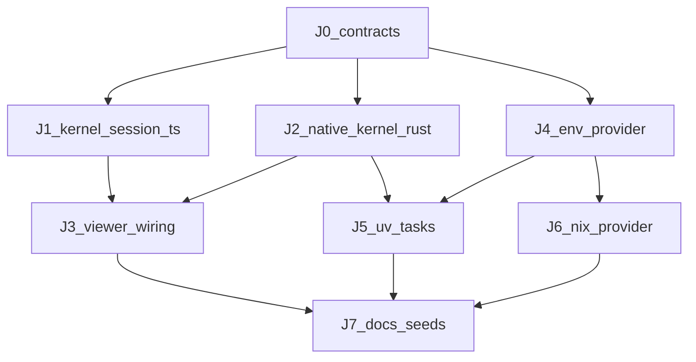
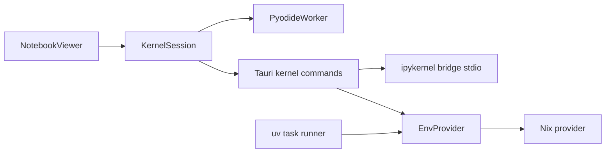

# Jupyter Phase-4 Local Compute DAG

**Status:** Active — J0 in progress  
**Created:** 2026-07-20  
**BASE:** `feat/demo-analytics-polish`  
**Integration branch:** `feat/demo-analytics-polish`  
**Model:** `cursor-grok-4.5-high` (`best-of-n-runner` worktrees)

Stack local native compute onto the demo-analytics polish tip: `KernelSession`,
out-of-process `ipykernel`, `uv` tasks, optional Nix. Remote kernels, scheduled
runs, and rich widgets stay out of this DAG.

## Problem / end state

Phase N3 already ships `.ipynb` open + Pyodide Run + `ResourceUpdate` persist.
Native Jupyter / `uv` / Nix were docs-only ([Jupyter and compute](../14-jupyter-python-nix-and-compute.md),
[ADR 0009](../decisions/0009-dual-python-and-jupyter-runtime.md)).

**Done when (this DAG only):**

1. Frontend `KernelSession` API; Pyodide is one backend, not the only path.
2. Native desktop can spawn an out-of-process `ipykernel` session, execute a
   cell, interrupt/cancel, shutdown; outputs still merge into `.ipynb`.
3. `*.task/` + `task.yaml` (`provider: uv`) runs with timeout, cwd, captured
   logs/exit code (no proposed-transaction writes yet).
4. Optional Nix env provider resolves flake/`nix-shell` PATH; missing Nix
   degrades honestly.
5. Docs/contracts updated; remote kernels, schedules, and widgets deferred.

## Defaults (locked)

| Decision | Choice |
|---|---|
| BASE / integration | Tip of `feat/demo-analytics-polish` (stack; not `main`) |
| Isolation | `best-of-n-runner` worktrees; merge after parent review |
| Subagent model | `cursor-grok-4.5-high` for every node |
| Kernel IPC | Out-of-process stdio JSON-lines bridge; no ZMQ in trusted Rust; no in-process CPython |
| Kernel host (v1) | Tauri-supervised session map; latticed supervision deferred |
| Env model | Shared `EnvProvider`: `system` \| `uv-project` \| `nix` (optional) |
| Runtime preference | Pyodide default/fallback; native opt-in when `uv`/`python`+ipykernel available |
| Out of DAG | Remote kernels, scheduled/`notebook.executed` jobs, ipywidgets/`comm`, Lattice Python SDK, proposed-transaction task outputs |

## DAG overview



## Waves

1. `J0` alone
2. `J1` ‖ `J2` ‖ `J4`
3. `J3` (needs J1+J2) ‖ `J5` (needs J4+J2) ‖ `J6` (needs J4)
4. `J7`
5. Parent validate + optional PR when asked

## Task status

| ID | Status | Model | Notes |
|---|---|---|---|
| J0 | in progress | cursor-grok-4.5-high | Contracts + this DAG tracker |
| J1 | pending | cursor-grok-4.5-high | `KernelSession` TS + Pyodide adapter |
| J2 | pending | cursor-grok-4.5-high | Native ipykernel Rust bridge + Tauri |
| J4 | pending | cursor-grok-4.5-high | Shared `EnvProvider` Rust |
| J3 | pending | cursor-grok-4.5-high | NotebookViewer native/Pyodide wiring |
| J5 | pending | cursor-grok-4.5-high | `uv` `task.yaml` runner |
| J6 | pending | cursor-grok-4.5-high | Optional Nix `EnvProvider` |
| J7 | pending | cursor-grok-4.5-high | Docs/seeds closeout |

Mark nodes `merged` only after parent review + merge into
`feat/demo-analytics-polish`.

## Architecture (target)



## Brief handoff summaries

### J0 — Contracts and DAG doc

Lock session/env/task shapes in `docs/14` + `docs/39`; add this tracker. Docs
only; no runtime code.

### J1 — Frontend `KernelSession` + Pyodide adapter

Introduce `ensure` / `execute` / `interrupt` / `dispose`; wrap existing
Pyodide as `createPyodideKernelSession`. No Tauri yet. Depends on J0.

### J2 — Native ipykernel supervisor

Rust crate + Python stdio bridge; Tauri
`kernel_start` / `kernel_execute` / `kernel_interrupt` / `kernel_shutdown`;
kill-on-drop session map. No viewer wiring; no Nix. Depends on J0.

### J3 — Viewer runtime selector

Wire native session over Tauri; prefer native when available else Pyodide;
browser stays Pyodide-only. Depends on J1 + J2.

### J4 — Shared `EnvProvider`

Resolve `{ python, path_env, provenance }` for `system` \| `uv-project` \|
nix stub. Depends on J0.

### J5 — `uv` task execution

Parse `task.yaml` (`provider: uv`); `uv run` with timeout/cwd; capture
stdout/stderr/exit. No proposed-tx outputs. Depends on J4 + J2.

### J6 — Optional Nix env provider

Implement `nix` provider; typed unavailable when missing; never silent
system fallback when nix was requested. Depends on J4.

### J7 — Docs, seeds, contract closeout

Align `docs/14`, `docs/39`, `docs/06`, demo notes; refresh DAG statuses.
Depends on J3 + J5 + J6.

## Explicit non-goals

- Remote Jupyter server attach
- Scheduled notebook / workflow triggers
- ipywidgets / `comm` channels
- In-process CPython in the trusted desktop process
- Folding unrelated `site/` polish into this DAG

## Verification (parent, as packets land)

```sh
cargo test -p lattice-kernel
cargo test -p lattice-commands --test '*'
pnpm --filter @lattice/desktop test
```
