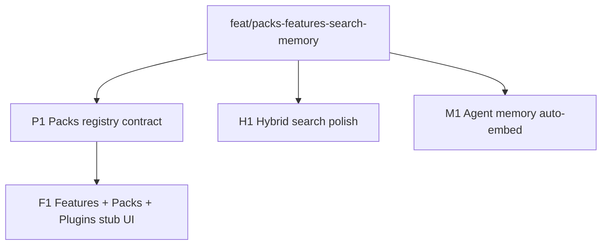

# Packs, Features, hybrid polish, agent-memory auto-embed DAG

Parent orchestrates; Composer 2.5 / Grok 4.5 execute in isolated worktrees.
Integration branch: `feat/packs-features-search-memory` off `main` (`beaf023`+).

## Problem / end state

1. **Packs registry** — one catalog for downloadable artifacts (embedding GGUF, voice FluidAudio) with status/download/clear.
2. **Features panel** — one Settings place to toggle first-party features (with pack deps); **Plugins** stub for future extensions.
3. **Hybrid search polish** — stale-aware UX in results + show fusion scores/ranks for Search + agents.
4. **Agent memory auto-embed** — remember/recall use workspace embedding provider; align dims with Qwen/Pioneer **512** (today wrongly fixed at 384).

## Base branch policy

`BASE` = `main`. Create `feat/packs-features-search-memory` from main. Each task worktree branches from integration tip at launch; merge into integration before dependents.

## DAG overview

Wave A (parallel): P1, H1, M1  
Wave B (after P1): F1

## Model assignments

| Task | Model | Notes |
|------|-------|-------|
| P1 Packs registry | `composer-2.5` | Shared contract |
| H1 Hybrid polish | `composer-2.5` | Search + handlers |
| M1 Auto-embed memory | `composer-2.5` | Lance + daemon + agentd |
| F1 Features/Packs UI | `cursor-grok-4.5-high` | Settings UX; parent reviews taste |

## Per-task handoffs

### Task `P1`: Packs registry contract

- **Problem:** Embedding and voice downloads are separate flows with no shared catalog.
- **Solution:**
  - Add a small shared registry (prefer `apps/desktop/src/lib/packs.ts` + optional thin Tauri status aggregation; Rust only if needed for paths).
  - Pack ids: `embeddings.qwen3-0.6b`, `voice.parakeet-unified` (stable string ids).
  - Each pack: `id`, `title`, `description`, `approxSizeLabel`, `license`, `featureIds[]`, `status` (`missing`\|`downloading`\|`ready`\|`failed`\|`unavailable`), download/clear entrypoints that **delegate** to existing `semantic_enable` / `prepareVoiceModel` (do not rewrite FluidAudio/embed-host).
  - Unit tests for catalog + status mapping helpers.
- **End state:** Typed catalog + helpers; no full Settings UI yet (F1).
- **Depends on:** feat branch
- **Out:** Features panel chrome; hybrid search; agent memory.

### Task `H1`: Hybrid search polish (stale + scores)

- **Problem:** Stale Lance only in Settings; Search UI shows Keyword/Semantic badges but not scores; agent/search fusion opacity is low.
- **Solution:**
  1. Ensure `SearchHitUi` / desktop `SearchHit` expose fused score (or rank) if not already; plumb through IPC if missing.
  2. SearchPane: show compact score/rank next to badge (subtle, not a dashboard).
  3. Stale: when semantic enabled and vectors behind (reuse `VECTORS_BEHIND_MESSAGE` / status), show a one-line banner in SearchPane (“Vectors behind workspace — results may prefer keywords”) with link/action to refresh if cheap; do not block search.
  4. Agent search tool description may mention ranks/scores only if response already returns them — do not invent new agent JSON schema unless handlers already have fields.
  5. Align desktop Cmd+K and agent defaults documentation in a short comment or keep `auto` vs `hybrid` but note in code; prefer ensuring hybrid responses include lexicalRank/semanticRank/fused when available.
- **End state:** Tests for score formatting / stale banner helpers; SearchPane updated; tsc clean for touched TS; cargo test for any Rust plumbing.
- **Depends on:** none (parallel)
- **Out:** ANN index; RRF k retune experiments; full Features UI.

### Task `M1`: Agent memory auto-embed

- **Problem:** Remember stores `dims=0`; recall is substring-only unless caller passes 384-d vectors, but workspace embeddings are **512-d**.
- **Solution:**
  1. Change `AGENT_MEMORY_EMBEDDING_WIDTH` to **512** (match Qwen/Pioneer). Document that existing agent-memory.lance tables must be recreated (delete dataset dir on width mismatch or version bump).
  2. In latticed `agent_memory_api`: on remember, if embedding omitted, embed `text` via the same embedding path the semantic indexer uses (session provider / embed-host). On recall without `query_embedding`, embed the query and use vector recall (optionally still apply text filter). Fallback to text-only if provider unavailable.
  3. Agent tools: remember/recall stay latticed-only; update descriptions to say vectors are embedded server-side when semantic provider is available.
  4. Tests: width constant; remember-with-auto-embed mocked or fake provider if test harness allows; path/store tests updated for 512.
- **Depends on:** none (parallel)
- **Out:** Consent ADR 0064; MCP catalog exposure; hybrid RRF for memory (nice-to-have if small — prefer vector+text filter first).

### Task `F1`: Features panel + Packs panel + Plugins stub

- **Problem:** Feature toggles and pack downloads are scattered (Search, Voice, AI, capabilities).
- **Solution:**
  - Settings nav: **Features**, **Packs**, and **Plugins** (stub).
  - **Features:** toggles for first-party features — at least `semanticSearch` (wire `search.semanticEnabled`), `voiceDictation` (prepared/enabled concept — don’t invent new profile fields unless needed; can be “pack ready + hint”), `agentMemory` (informational enable stub or profile bool if trivial), keep existing **Enabled capabilities** or deep-link to it.
  - When enabling a feature that needs a pack, show pack status + Download via P1 registry (don’t duplicate AI mode chrome).
  - **Packs:** list registry packs with download/clear/status (Voice + Embeddings).
  - **Plugins:** stub copy — custom/WASM/MCP extensions later; no fake marketplace.
  - Preserve AI / Voice / Search sections but add cross-links (“Managed under Packs/Features”).
  - Match existing Settings design tokens; no purple AI-slop; one job per section.
- **Depends on:** P1 merged
- **Out:** Real plugin loader; FluidAudio harness fixes.

## Merge / validation order

1. Create feat branch + commit this plan
2. Merge P1, H1, M1 as each passes review
3. Merge F1 after P1
4. Parent smoke: packs helpers tests, search UI types, agent-memory width 512 + API compile
