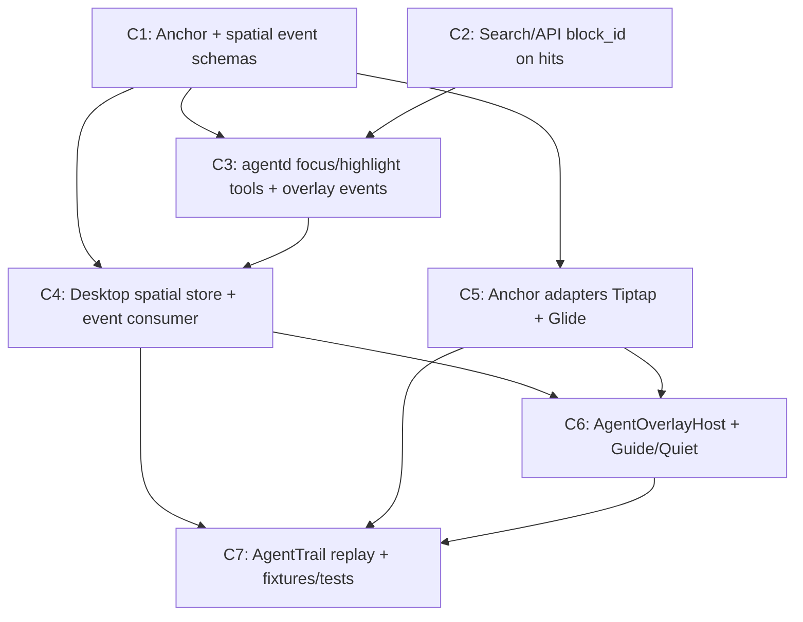

# Phase C Spatial UI DAG (anchors / highlight / navigate)

**Status:** Planned  
**Created:** 2026-07-24  
**BASE:** `main` (active at plan time; ahead of origin)  
**Integration:** land each task branch onto `BASE` before launching dependents  
**Execution models:** Composer 2.5 subagents (`isolation` worktree / local Task)  
**Parent:** plans, reviews, merges — does not re-implement passed nodes

Research inputs:

- [page/grid focus APIs](a4d1a2d6-d91c-49f2-8bd7-b2a5e47e9289)
- [Phase C docs + agent surface](d14af370-07ee-477c-8b69-dc4576685576)

Architecture source of truth: `docs/architecture/embedded-agent.md` §11, §27 Phase C.

## Problem / end state

**Problem:** Phase A/B agent can search, read, and propose, but cannot point at a
specific table row or document block in the desktop UI.

**End state (MVP success):** With Guide mode, an agent (or fake fixture) can
`focus_anchor` / `highlight_anchors` so the shell opens/reveals a resource and
visually highlights either a Glide row (`dataset-region`) or a Tiptap block
(`markdown-block`). Trail lists the navigation step; clicking it replays reveal.

**Out of MVP:** Follow mode auto-tour, `annotate_anchor`, `open_split_view`,
code/chart/canvas/terminal anchors, full Sources tab polish, Perspective adapters.

## Base branch policy

Each task branches from **`main` (`BASE`)** at launch. Dependents launch only
after their blockers are reviewed and merged into `BASE`. Do not implement
parallel work in the primary checkout while worktree agents are in flight.

## DAG overview

**Waves**

1. **W1 (parallel):** C1 ‖ C2  
2. **W2 (after W1):** C3 ‖ C4 ‖ C5  
3. **W3 (after C4+C5):** C6  
4. **W4 (after C6):** C7  

## Locked MVP cuts

- Anchor kinds: **`markdown-block` + `dataset-region` only**
- Event naming: **snake_case** (`overlay_show`, `evidence_added`, …) matching Phase A
- Follow modes: **Guide (default) + Quiet**; defer Follow
- Tools: `focus_anchor`, `highlight_anchors` only (no annotate/split)
- Highlights: ProseMirror `DecorationSet` + Glide selection/theme — **not** React per-cell
- Caps: ≤20 anchors / call; ≤8KB spatial event payload
- `open_resource` can be a thin desktop helper used by adapters; agent tool optional if
  `focus_anchor` already opens the path

## Packet status

| ID | Title | Status | Model |
| --- | --- | --- | --- |
| C1 | Anchor + spatial event schemas | done | composer-2.5 |
| C2 | Search/API `block_id` on hits | done | composer-2.5 |
| C3 | agentd spatial tools + event emission | pending | composer-2.5 |
| C4 | Desktop spatial store + event consumer | pending | composer-2.5 |
| C5 | Tiptap + Glide anchor adapters | pending | composer-2.5 |
| C6 | Overlay host + Guide/Quiet | pending | composer-2.5 |
| C7 | Trail replay + fixtures/tests | pending | composer-2.5 |

---

## Handoff packets

### Task `C1`: Anchor + spatial event schemas

- **Problem:** No shared `WorkspaceAnchor` or overlay/trail event types; Phase C
  cannot be typed across agentd ↔ desktop.
- **Solution:**
  - Add `packages/agent-protocol/src/anchors.ts` with Zod for
    `markdown-block` + `dataset-region` (full union stubs OK if other kinds are
    `z.never()` / deferred).
  - Extend `events.ts` with `step_started`, `step_completed`, `evidence_added`,
    `overlay_show`, `overlay_clear` (snake_case).
  - Export from package index; mirror opaque forwarding in
    `apps/daemon/src/agent/protocol.rs` if needed (payload stays JSON).
- **Implement:** Zod schemas + unit/golden tests; no UI, no tools.
- **End state:** `pnpm --filter @lattice/agent-protocol test` (or package equivalent)
  passes; invalid anchors reject; events round-trip.
- **Depends on:** none
- **Subagent / model:** generalPurpose / composer-2.5
- **Effort / scope bound:** Schemas + tests only. No desktop/agentd behavior.
- **Return:** summary, diff stats, test commands+results, risks

### Task `C2`: Search/API `block_id` on hits

- **Problem:** Search hits expose `chunk_id` / heading / bytes but not indexer
  `block_id`, so agents cannot build `markdown-block` anchors from search.
- **Solution:**
  - Plumb structural `block_id` from `lattice-index` chunks into
    `SearchHitDto` / related context excerpts in `apps/daemon/src/api.rs`.
  - Keep desktop IPC additive (optional field).
- **Implement:** API DTO + mapping from hybrid/FTS hits; unit test that a known
  page chunk returns a non-empty `blockId`.
- **End state:** `cargo test -p lattice-daemon` filtered tests for search DTO;
  JSON field present when chunk has block id.
- **Depends on:** none (parallel with C1)
- **Subagent / model:** generalPurpose / composer-2.5
- **Effort / scope bound:** API/index plumbing only. No agent tools or UI.
- **Return:** summary, diff stats, test commands+results, risks

### Task `C3`: agentd focus/highlight tools + overlay events

- **Problem:** agentd has read/propose tools only; no way to request spatial UI.
- **Solution:**
  - Add `focus_anchor` and `highlight_anchors` tools validating C1 schemas.
  - On execute, emit `step_started` → `overlay_show` → `step_completed` on the
    JSONL agent event sink (side channel), return small `{ ok, overlayId }`.
  - Do not put full page/row payloads in the event.
- **Implement:** `apps/agentd/src/tools.ts`, `runner.ts`; extend
  `tools.test.ts`.
- **End state:** Tool tests assert event sequence; no DOM access from agentd.
- **Depends on:** C1, C2 (C2 so tool docs/examples can cite `blockId` from search)
- **Subagent / model:** generalPurpose / composer-2.5
- **Effort / scope bound:** Tools + event emission only. No desktop adapters.
- **Return:** summary, diff stats, test commands+results, risks

### Task `C4`: Desktop spatial store + event consumer

- **Problem:** `agentStore` only keeps trail labels; overlay/evidence/follow
  state has nowhere to live.
- **Solution:**
  - Expand store: `followMode` (`guide`|`quiet`), `activeOverlays`,
    `trailSteps[]`, `evidence[]`.
  - Typed `consumeEvent` for C1 spatial events; keep chat `useChat` free of
    overlay paint state.
- **Implement:** `apps/desktop/src/agent/agentStore.ts`, wire in
  `LatticeAgentProvider` / `lib/agent.ts` event path.
- **End state:** Unit tests for consumeEvent transitions; Guide vs Quiet gate
  for whether `reveal` is requested (adapter call can be stubbed).
- **Depends on:** C1 (and practically C3 for live events, but store can land on C1)
- **Subagent / model:** generalPurpose / composer-2.5
- **Effort / scope bound:** Store + event routing only. No decorations/overlays UI.
- **Return:** summary, diff stats, test commands+results, risks

### Task `C5`: Anchor adapters (Tiptap + Glide)

- **Problem:** Surfaces have no imperative reveal/highlight API for agents.
- **Solution:**
  - `AgentAnchorAdapter` registry with `reveal` + `highlight`.
  - Tiptap: map `blockId` (or heading path fallback) → decoration + scrollIntoView;
    reuse Decoration patterns from dictation/drag handles.
  - Glide: map `rowKeys` → `DataRow.id`, `setGridSelection` + scroll; handle
    “not visible” under filter/sort with a soft fallback message.
- **Implement:** `apps/desktop/src/agent/adapters/*`; hooks in `PageEditor` /
  `DataTableView` (minimal surface API on handles).
- **End state:** Adapter unit tests with mocks; no React per-cell highlight state.
- **Depends on:** C1
- **Subagent / model:** generalPurpose / composer-2.5
- **Effort / scope bound:** Two adapters only. No overlay host chrome.
- **Return:** summary, diff stats, test commands+results, risks

### Task `C6`: AgentOverlayHost + Guide/Quiet

- **Problem:** No host to apply overlays from store → adapters; no mode control.
- **Solution:**
  - Mount `AgentOverlayHost` in `DesktopShell` beside main content.
  - Subscribe to `activeOverlays`; call adapters; clear on `overlay_clear`.
  - `AgentFollowControl`: Guide/Quiet toggle; Quiet skips viewport moves.
  - User scroll/edit must not cancel the agent run.
- **Implement:** new agent UI components + shell mount; CSS with `--lt-*` only.
- **End state:** Manual or component test: overlay_show with Guide reveals;
  Quiet shows trail/reference without forcing scroll.
- **Depends on:** C4, C5
- **Subagent / model:** generalPurpose / composer-2.5  
  (If visual polish is the main deliverable, parent may take chrome — keep
  structure in this task.)
- **Effort / scope bound:** Host + mode control. No Follow auto-tour. No annotate.
- **Return:** summary, diff stats, test commands+results, risks

### Task `C7`: AgentTrail replay + fixtures/tests

- **Problem:** Trail is labels only; no replay; no fake spatial fixture for CI.
- **Solution:**
  - `AgentTrail` list from `trailSteps`; click navigation step → replay
    reveal/highlight via adapters.
  - Fake provider / fixture: search → highlight row or block event sequence.
  - Tests per §26.3 subset: trail step appears; Tiptap decoration applied;
    Glide row selected.
- **Implement:** trail UI, fake path, vitest (+ optional Tauri smoke if cheap).
- **End state:** Documented smoke path; unit/integration green for MVP success
  condition.
- **Depends on:** C6 (and thus C3–C5)
- **Subagent / model:** generalPurpose / composer-2.5
- **Effort / scope bound:** Trail + fixtures/tests. No Sources tab redesign.
- **Return:** summary, diff stats, test commands+results, risks

---

## Merge / validation order

1. Merge C1, C2 → `BASE`  
2. Merge C3, C4, C5 → `BASE` (parallel OK after step 1)  
3. Merge C6 → `BASE`  
4. Merge C7 → `BASE`; run focused tests listed in packets  

## Risks (carry into reviews)

- IndexProgress / tool floods — keep spatial events on quiet agent bus; cap payloads  
- React hot loops — decorations/Glide only, Zustand holds metadata  
- `block_id` mapping mistakes — prefer indexer structural id over inventing editor UniqueIDs in MVP  
- Naming drift (`overlay.show` vs `overlay_show`) — snake_case locked above  
