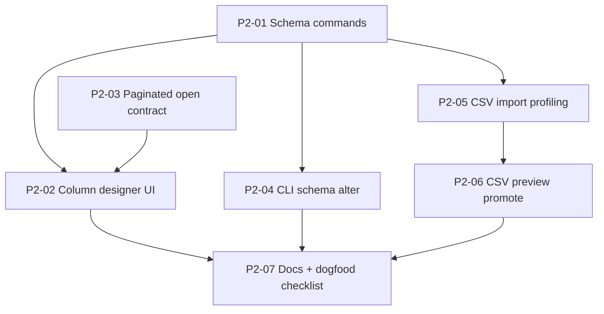

# Phase 2 Tables — Wave 1 Subagent DAG

**Status:** Draft — awaiting approval before launch  
**Created:** 2026-07-18  
**BASE policy:** Integration branch `phase2-tables` from `main` at skill start (see §Base branch).  
**Subagent models:** `composer-2.5` (routine) and `cursor-grok-4.5-high` (architecture-sensitive) only.  
**Parent:** plans, reviews diffs, merges; keeps design/taste nodes in-loop.

## Problem / end state

Phase 2 already has a vertical slice: `/table` → `.data` SQLite package, Glide grid, six view layouts, record detail, relations, package forms, CSV import, CLI table/record commands.

Wave 1 closes the credibility gap between “demo-grade table” and “editable typed database you can grow”:

1. Schema changes go through the semantic command engine (not library bypasses).
2. Users can add/edit columns from the desktop without leaving the grid.
3. CSV import offers a type-review step before commit; CSV preview can promote to a table.
4. Opening a large table does not force a 500-row hard wall into memory without a windowed path.

**Out of Wave 1 (later waves):** canvas interfaces, buttons/actions, Excel/JSON import, FormSave designer, collaborative SQLite profiles, API/MCP (Phase 4), DuckDB/Arrow (Phase 3).

## Base branch policy

- Active branch at skill start: `main` (dirty with unrelated voice/canvas WIP).
- **Do not** land Wave 1 onto dirty `main` while voice/canvas edits are uncommitted.
- Create clean integration branch `phase2-tables` from `origin/main` (or clean `main` tip) once approved.
- Each executable task launches with worktree isolation from whatever is checked out as BASE (= `phase2-tables` after it exists).
- Dependents launch only after their dependency’s branch is **reviewed and merged into `phase2-tables`**.

## DAG overview

**Wave A (parallel):** P2-01, P2-03  
**Wave B (after A merges):** P2-02, P2-04, P2-05  
**Wave C (after P2-05):** P2-06  
**Wave D (after B+C):** P2-07

## Model / subagent-type assignments

| Task | Type | Model | Why |
|------|------|-------|-----|
| P2-01 | generalPurpose | cursor-grok-4.5-high | Command/undo architecture, shared contracts |
| P2-03 | generalPurpose | cursor-grok-4.5-high | IPC contract + pagination semantics |
| P2-02 | generalPurpose | composer-2.5 | UI wiring on stable contracts |
| P2-04 | generalPurpose | composer-2.5 | CLI surface |
| P2-05 | generalPurpose | composer-2.5 | Import flow + Tauri/CLI |
| P2-06 | generalPurpose | composer-2.5 | Text viewer promote action |
| P2-07 | generalPurpose | composer-2.5 | Docs only |

Design/taste for column designer chrome and import wizard layout stays with the parent if a review finds checklist-passing but taste-regressing UI.

## Merge / validation order

1. Merge P2-01 → `phase2-tables`  
2. Merge P2-03 → `phase2-tables`  
3. Launch P2-02, P2-04, P2-05 in parallel  
4. Merge those three  
5. Launch/merge P2-06  
6. Launch/merge P2-07  
7. Parent runs: `cargo test -p lattice-data -p lattice-commands` and `pnpm --filter @lattice/desktop test` (scoped) on `phase2-tables`

---

## Per-task handoff packets

### Task `P2-01`: Semantic schema commands

- **Problem:** `add_columns` / `add_table` exist in `lattice-data` but bypass the command engine; CSV import and any future column UI cannot obey ADR 0007 undo/revision rules.
- **Solution:**
  - Add `SemanticCommand` variants for adding a table and adding columns (names TBD to match existing enum style).
  - Implement apply + undo in `engine.rs` with package revision guards where appropriate.
  - Route Tauri `import_csv_table` and CLI import to use the new commands instead of direct library calls.
  - Keep field types to the existing seven; do not invent formula/lookup/enum yet.
- **Implement:**
  - `crates/lattice-commands/src/command.rs`, `engine.rs`, `tests.rs`
  - Touch `crates/lattice-data` only if undo needs richer snapshots (prefer minimal)
  - Update `apps/desktop/src-tauri/src/data.rs` CSV import path to use commands
  - Update `apps/cli` import path similarly if it bypasses today
- **End state:**
  - Unit tests: add column → undo restores schema + `app.yaml`; add table → undo removes table files/rows safely
  - CSV import no longer calls `add_columns` outside the command engine
  - `cargo test -p lattice-commands -p lattice-data` passes
- **Depends on:** none
- **Subagent type / model:** generalPurpose / cursor-grok-4.5-high
- **Effort / scope bound:** No UI. No pagination. No new field types. No FormSave.
- **Return:** summary, diff stats, test commands+results, risks

### Task `P2-03`: Paginated open contract

- **Problem:** `open_data_app` always materializes ≤500 rows into `DataAppSnapshot`; Glide virtualizes paint but not data.
- **Solution:**
  - Extend Tauri open (and Rust helpers if needed) with `limit` + `offset` (or cursor) request params; default preserves current behavior for callers that omit them.
  - Return total row count (or `has_more`) so the UI can page/window.
  - Do not rewrite Glide yet — contract only + tests; P2-02 consumes it lightly or leaves a TODO if UI lands same wave.
- **Implement:**
  - `apps/desktop/src-tauri/src/data.rs` (+ registration if signature changes)
  - `apps/desktop/src/data/types.ts` snapshot fields
  - Mirror tests in Tauri `data.rs` mod tests
  - Avoid large `DataTableView.tsx` refactors (leave consumption to P2-02 or a follow-up note)
- **End state:**
  - `open_data_app` with offset/limit returns the window + total/has_more
  - Existing callers without params still get ≤500 rows (compat)
  - Tests cover windowed fetch and total count
- **Depends on:** none (parallel with P2-01; coordinate if both edit `data.rs` — prefer P2-01 owns CSV section, P2-03 owns open/snapshot DTO; merge carefully)
- **Subagent type / model:** generalPurpose / cursor-grok-4.5-high
- **Effort / scope bound:** No infinite-scroll UI polish. No DuckDB/Arrow.
- **Return:** summary, diff stats, test commands+results, risks; document merge conflict notes for `data.rs`

### Task `P2-02`: Column designer UI

- **Problem:** Empty `/table` packages are id-only; users cannot add typed columns or relations from the desktop.
- **Solution:**
  - Toolbar/chrome in `DataTableView` (or small sibling component) to add column: name, field type, optional relation target.
  - Invoke new Tauri wrappers over P2-01 commands; refresh snapshot; handle stale revision.
  - Optionally show a lightweight “edit column type” if cheap; otherwise add-only is enough for Wave 1.
  - If P2-03 is merged, wire open to pass limit/offset with a simple “Load more” or status “Showing N of M” — keep UX minimal.
- **Implement:**
  - `apps/desktop/src/data/DataTableView.tsx` (+ new small component file if cleaner)
  - Tauri invoke wrappers in `data.rs` if P2-01 did not expose them
  - `types.ts` as needed
  - Styles under existing `.data-table-*` in `styles.css` (minimal)
  - Tests: prefer unit tests for pure helpers; document manual check for UI
- **End state:**
  - Native: create table → add text/integer/relation column → cell edit works → undo via existing journal if wired
  - Browser demo: clear degraded message or local-only stub (do not pretend persistence)
- **Depends on:** P2-01, P2-03
- **Subagent type / model:** generalPurpose / composer-2.5
- **Effort / scope bound:** No full schema designer modal suite. No migrations UI. Parent may restyle after merge.
- **Return:** summary, diff stats, test commands+results, risks

### Task `P2-04`: CLI schema alter

- **Problem:** CLI can create/import but not add columns/tables after the fact.
- **Solution:** Add `lattice table add-column` / `add-table` (exact clap shape matching repo style) calling P2-01 commands.
- **Implement:** `apps/cli/src/main.rs`, `apps/cli/tests/cli.rs`
- **End state:** CLI integration test creates package, adds column, shows schema/rows reflecting change
- **Depends on:** P2-01
- **Subagent type / model:** generalPurpose / composer-2.5
- **Effort / scope bound:** No view save CLI unless trivial. No forms CLI.
- **Return:** summary, diff stats, test commands+results, risks

### Task `P2-05`: CSV import profiling

- **Problem:** CSV import infers types and commits with no user review; profiling is a Phase 2 checklist item.
- **Solution:**
  - After parse/infer, surface a confirmation step (desktop): column names, inferred types (editable), then commit via P2-01 schema commands + `RecordInsert`.
  - Keep CLI non-interactive default; optional flags `--type col:integer` if cheap.
  - Reuse `crates/lattice-data/src/csv.rs` inference; do not add Excel/JSON.
- **Implement:**
  - Desktop flow in `desktopActions.ts` + small profiling UI component under `apps/desktop/src/data/`
  - Tauri: maybe split `preview_csv_import` vs `commit_csv_import` if needed
  - Tests for inference mapping helpers
- **End state:** Import CSV shows type review; user can change a column type before create; package matches choices
- **Depends on:** P2-01
- **Subagent type / model:** generalPurpose / composer-2.5
- **Effort / scope bound:** CSV only. No Excel/JSON. Taste polish may be parent follow-up.
- **Return:** summary, diff stats, test commands+results, risks

### Task `P2-06`: CSV preview promote

- **Problem:** `CsvTablePreview` is read-only; promote-to-table is a documented progressive path and still missing.
- **Solution:** Add “Create table from CSV…” on the text/CSV viewer that reuses P2-05 commit path (or `import_csv_table` with profiling).
- **Implement:**
  - `apps/desktop/src/viewers/text/CsvTablePreview.tsx` / `TextViewer.tsx`
  - Wire through existing desktop actions
- **End state:** Open `sample.csv` → promote → real `.data` package opens
- **Depends on:** P2-05
- **Subagent type / model:** generalPurpose / composer-2.5
- **Effort / scope bound:** No in-place conversion of the CSV file; creates a sibling/new `.data` package.
- **Return:** summary, diff stats, test commands+results, risks

### Task `P2-07`: Docs + dogfood checklist

- **Problem:** Docs still describe aspirational schema/import flows; dogfood checklist should match Wave 1.
- **Solution:** Update `docs/10-data-applications-and-airtable-model.md` only where behavior changed; update `docs/dev/first-look-dogfood.md` with column designer + CSV profile + promote steps.
- **Implement:** docs only; link this DAG file as the Wave 1 tracker.
- **End state:** Docs match shipped Wave 1 behavior; no Phase 3 claims.
- **Depends on:** P2-02, P2-04, P2-06
- **Subagent type / model:** generalPurpose / composer-2.5
- **Effort / scope bound:** No roadmap renumbering. No ADR unless a contract is irreversible (prefer not).
- **Return:** summary, diff stats, risks

---

## Shared-file conflict map

| File | Owners |
|------|--------|
| `crates/lattice-commands/src/{command,engine,tests}.rs` | P2-01 only in Wave A |
| `apps/desktop/src-tauri/src/data.rs` | P2-01 (CSV), P2-03 (open/DTO) — merge order 01 then 03 if both touch |
| `apps/desktop/src/data/DataTableView.tsx` | P2-02 |
| `apps/cli/src/main.rs` | P2-04 (and light P2-01 if import rewired — prefer P2-01 does import rewire) |
| `apps/desktop/src/data/types.ts` | P2-03 then P2-02 |
| `styles.css` | P2-02 / P2-05 only, localized selectors |

## Anti-patterns to avoid

- Starting P2-02 before P2-01 is merged into `phase2-tables`
- Implementing in the primary dirty `main` checkout
- Expanding into interfaces/buttons/DuckDB
- Marking tasks complete before review + merge
