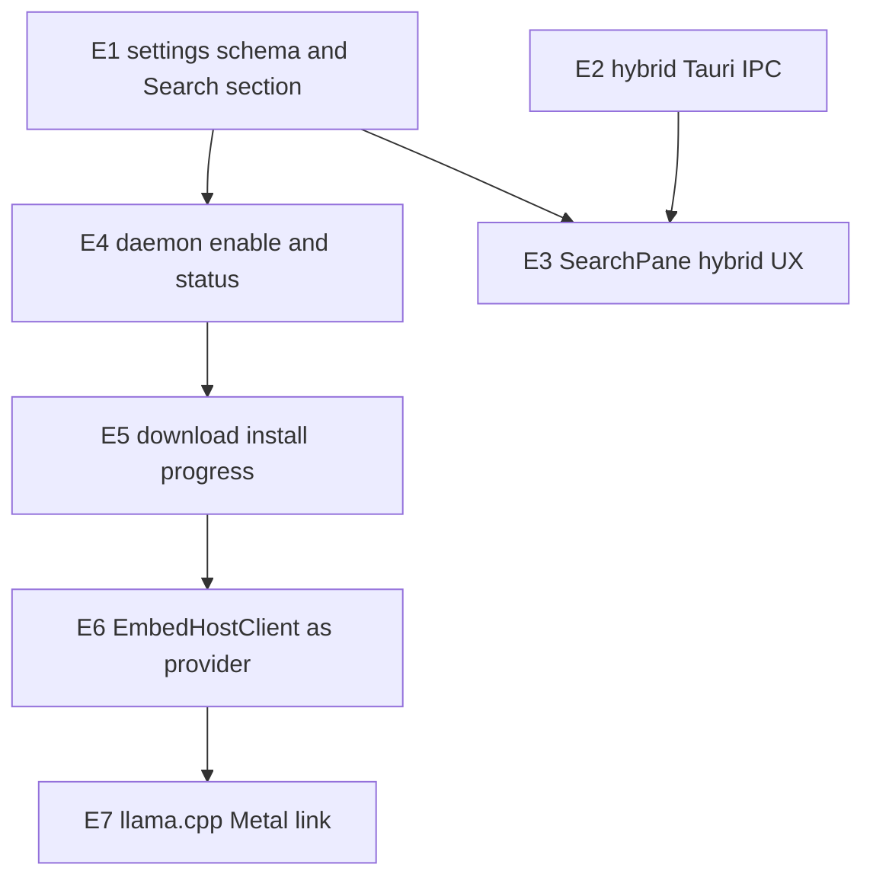

# Semantic Search Enablement — Subagent DAG (E1–E7)

**Status:** Superseded by `fix/semantic-search-p0-p2` (P0–P2 wiring + quality fixes)  
**Created:** 2026-07-19  
**BASE:** `feat/semantic-search-enablement` from `origin/main` @ `0778165`  
**Subagent models:** `composer-2.5` (routine) and `cursor-grok-4.5-high` (architecture)  
**Parent:** plans, reviews diffs, merges; keeps SearchPane / confirm-dialog taste in-loop.

> **2026-07-20 follow-up:** Production defaults, desktop→latticed routing, host
> multiplexing, stable chunk IDs, enriched embedding inputs, FTS AND parsing, and
> the Fake eval harness landed on `fix/semantic-search-p0-p2`. See that branch
> / PR for the honest enable path (no silent Fake after Qwen download).

## Problem / end state

Hybrid search infra is on `main` (chunks, RRF, runtime worker, embed-host fake, daemon HTTP/MCP). Product gap: no settings toggle, no download/prepare UX, Tauri SearchPane is FTS-only, and daemon “host” modes still embed with `FakeEmbeddingProvider`.

**Done when:**

- Settings → Search: enable semantic search (off by default) → confirm size/license → download+verify → load → background embedding
- FTS always works; hybrid used when ready; degraded host falls back to FTS
- SearchPane shows hybrid hits with Keyword/Semantic/Both hints
- latticed owns enablement/jobs (voice thin-client pattern); desktop is client
- Real embed-host provider used for jobs (not fake-behind-socket); llama.cpp+Metal produces vectors for Qwen3 Q8 @ 512-d

**Out of scope:** Core ML (S7), battery policies, MCP polish, editor scroll-to-byte-range, Phase 2 tables.

## Defaults (locked)

| Decision | Choice |
|---|---|
| BASE | clean `main` @ `0778165` → integration `feat/semantic-search-enablement` |
| Models | `cursor-grok-4.5-high` (arch/daemon/host) · `composer-2.5` (settings/UI/docs) |
| Isolation | `best-of-n-runner` worktrees; merge into integration after parent review |
| Enable path | latticed-owned; persist `search.semanticEnabled` in desktop settings |
| Model acquire | Download-on-enable: pinned URL + sha256; Fake remains for CI |
| Search open | Chunk hits open resource path (no scroll-to-byte) |
| Browser demo | Explicit unavailable card (mirror Voice) |

## DAG overview

**Wave A (parallel):** E1, E2  
**Wave B (after E1+E2):** E3, E4  
**Wave C (after E4):** E5  
**Wave D (after E5):** E6  
**Wave E (after E6):** E7  

Ship gate for “embeddings working”: E1–E6. E7 required for production vectors.

## Model / subagent-type assignments

| Task | Type | Model | Why |
|------|------|-------|-----|
| E1 | generalPurpose | composer-2.5 | Settings schema + Voice-pattern UI shell |
| E2 | generalPurpose | cursor-grok-4.5-high | Hit DTO / IPC contract blast radius |
| E3 | generalPurpose | composer-2.5 | Wire SearchPane; parent may restyle |
| E4 | generalPurpose | cursor-grok-4.5-high | Daemon enablement + events |
| E5 | generalPurpose | cursor-grok-4.5-high | Download/verify/progress |
| E6 | generalPurpose | cursor-grok-4.5-high | Replace fake-behind-host |
| E7 | generalPurpose | cursor-grok-4.5-high | llama.cpp+Metal link |

## Merge / validation order

1. Merge E1, E2 → `feat/semantic-search-enablement`
2. Launch/merge E3 ∥ E4
3. Launch/merge E5 → E6 → E7
4. Parent: `cargo test -p lattice-index -p lattice-handlers -p lattice-runtime -p lattice-embed-host` (+ daemon tests scoped) and `pnpm --filter @lattice/desktop test`

## Per-task handoff packets

### Task `E1`: Settings schema + Search section

- **Problem:** No `search.semanticEnabled`; Settings has no Search section.
- **Solution:**
  - Add `SearchSettings { semanticEnabled: bool }` to Rust profile settings + TS profile.
  - Settings → Search with toggle + status placeholder (read-only stub until E4).
  - Mirror Voice layout patterns in SettingsPage.
- **Implement:**
  - `crates/lattice-profile/src/settings.rs`
  - `apps/desktop/src/lib/profile.ts`
  - `apps/desktop/src/settings/SettingsPage.tsx` (+ model if needed)
  - Persist via existing settings save; default `semanticEnabled: false`
  - Browser: unavailable card
- **End state:** Toggle persists across relaunch; unit/serde defaults tests; no worker start yet.
- **Depends on:** none
- **Subagent type / model:** generalPurpose / composer-2.5
- **Effort / scope bound:** No download, no hybrid IPC, no SearchPane changes.
- **Return:** summary, diff stats, test commands+results, risks

### Task `E2`: Hybrid Tauri IPC

- **Problem:** Tauri only exposes FTS `search_workspace`; handlers already have `hybrid_search_workspace*`.
- **Solution:**
  - Extend search command with `mode: "fts" | "hybrid" | "auto"` (auto = hybrid if session semantic ready else FTS).
  - Return UI DTO: path, title, snippet/excerpt, fusedScore, optional lexicalRank/semanticRank, optional headingPath/chunkId.
  - Register in `generate_handler!`; allowlist bridge if needed.
- **Implement:**
  - `crates/lattice-handlers/src/search.rs`
  - `apps/desktop/src-tauri/src/search.rs`, `lib.rs`
  - `apps/desktop/src/types.ts`, `apps/desktop/src/lib/ipc.ts`
  - Tests for FTS fallback + fake hybrid
- **End state:** Invoke hybrid returns ranks when provider present; FTS path unchanged for mode=fts.
- **Depends on:** none (parallel E1; avoid editing SettingsPage)
- **Subagent type / model:** generalPurpose / cursor-grok-4.5-high
- **Effort / scope bound:** No UI chrome; no download.
- **Return:** summary, diff stats, test commands+results, risks

### Task `E3`: SearchPane hybrid UX

- **Problem:** `SearchPane.tsx` always calls FTS; demo claims hybrid falsely.
- **Solution:** Call mode=auto when `semanticEnabled`; show Keyword/Semantic/Both from ranks; empty-state when indexing; browser keeps demoSearch.
- **Implement:** `apps/desktop/src/SearchPane.tsx` (+ callers for semanticEnabled prop); light tests if helpers extracted.
- **End state:** Enable flag + fake ranks show badges; disable → pure FTS.
- **Depends on:** E1, E2
- **Subagent type / model:** generalPurpose / composer-2.5
- **Effort / scope bound:** No scroll-to-byte; no Settings download UI. Parent may restyle badges.
- **Return:** summary, diff stats, test commands+results, risks

### Task `E4`: Daemon enable + status (latticed-owned)

- **Problem:** Semantic worker is env-gated; no user-driven start/stop/status for desktop.
- **Solution:**
  - When `semanticEnabled`, desktop/Tauri asks latticed to enable semantic for the workspace session (Fake OK until E5/E6).
  - Expose `semantic_status` / events: `stopped|preparing|indexing|ready|degraded|failed` + pending chunk count.
  - Wire Settings status (replace E1 stub). Kick worker on enable; stop/pause on disable.
- **Implement:** `apps/daemon/src/embed_host.rs`, runtime semantic APIs, Tauri commands + `apps/desktop/src/lib/semantic.ts` mirroring `voice.ts`.
- **End state:** Toggle ON → Fake worker embeds pending; hybrid ranks appear; toggle OFF → FTS only; degrade tests.
- **Depends on:** E1
- **Subagent type / model:** generalPurpose / cursor-grok-4.5-high
- **Effort / scope bound:** No real GGUF download; may still use Fake provider.
- **Return:** summary, diff stats, test commands+results, risks

### Task `E5`: Download / install / progress

- **Problem:** embed-host `install_model` is local copy only; no download UX.
- **Solution:** Pinned manifest (Qwen3-Embedding-0.6B Q8). Enable → confirm → download + sha256 → install/load. Never download inside a search request. CI must not require network.
- **Implement:** Download helper (daemon or embed-host); progress events; Settings confirm UI.
- **End state:** Fresh enable downloads+verifies; corrupt sha fails closed; status shows Downloading N%.
- **Depends on:** E4
- **Subagent type / model:** generalPurpose / cursor-grok-4.5-high
- **Effort / scope bound:** No llama inference yet; Fake/fixture path for CI.
- **Return:** summary, diff stats, test commands+results, risks

### Task `E6`: Real EmbedHostClient as job provider

- **Problem:** SpawnHost/ExternalSocket still use in-process Fake for jobs.
- **Solution:** Use embed-host UDS client as `EmbeddingProvider`. Socket down → SemanticDegraded + FTS. Keep FakeInProcess for tests.
- **Implement:** `apps/daemon/src/embed_host.rs`, embed-host client, UDS integration test.
- **End state:** Vectors from host RPCs; kill host → degrade.
- **Depends on:** E5
- **Subagent type / model:** generalPurpose / cursor-grok-4.5-high
- **Effort / scope bound:** No Metal link (E7).
- **Return:** summary, diff stats, test commands+results, risks

### Task `E7`: llama.cpp + Metal link

- **Problem:** `apps/embed-host/src/backend/llama.rs` returns `backend_unavailable`.
- **Solution:** Link llama.cpp+Metal behind `--features llama-cpp`; load verified GGUF; last-token pool + L2 @ 512-d. Fake remains default for CI.
- **End state:** Feature build embeds real vectors; document nix/feature enablement.
- **Depends on:** E6
- **Subagent type / model:** generalPurpose / cursor-grok-4.5-high
- **Effort / scope bound:** No Core ML; no Windows/Linux packaging beyond compile notes.
- **Return:** summary, diff stats, test commands+results, risks

## Parent-owned (not delegated)

- SearchPane badge/empty-state taste pass after E3
- Enable confirm dialog copy/size presentation after E5
- Final First Look demo honesty pass (Home.md hybrid claim)

## Explicit non-goals

- Core ML embedding backend (S7)
- Phase 2 tables Wave 1
- Editor scroll-to-byte-range
- Battery / thermal policies beyond existing degrade
