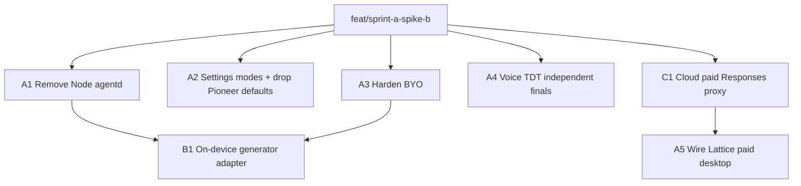

# Sprint A + Spike B DAG

Integration: `feat/sprint-a-spike-b` off lattice `main`.
Cloud paid proxy: ecosystem `feat/sprint-a-paid-proxy` off ecosystem `main`
(merge independently; lattice wires once cloud route exists).

Refs: `docs/architecture/ai-platform-status-and-roadmap.md` §4 Sprint A / Spike B
(ecosystem), ADR 0072–0073.

## End state

1. Settings modes: **BYO** / **On-device** / **Lattice paid** (enum ids may stay).
2. Node `apps/agentd` removed; only Rust `lattice-agentd`.
3. Pioneer not default for embeddings or agent provider selection.
4. BYO: profile mode forces openai + keychain key; clear UX if missing.
5. Lattice paid: cloud Responses proxy + desktop can run agent when signed in
   (server-held OpenAI key).
6. Voice: `IndependentOfflineRedecode` via Parakeet TDT v2 (or documented
   stub+flag if weights gate blocks; prefer real path).
7. Spike B: local Qwen instruct path behind Responses-shaped provider in
   `lattice-agentd` (minimal tool-loop proof).

## DAG

Wave 1 (parallel): A1, A2, A3, A4, C1  
Wave 2: A5 (after C1), B1 (after A1+A3)

## Models

| Task | Model |
|------|-------|
| A1 Remove Node | composer-2.5 |
| A2 Settings + Pioneer | cursor-grok-4.5-high (UI) |
| A3 Harden BYO | composer-2.5 |
| A4 Voice TDT | composer-2.5 |
| C1 Cloud proxy | composer-2.5 |
| A5 Wire paid desktop | composer-2.5 |
| B1 Local generator | composer-2.5 |

## Handoffs

### A1 Remove Node agentd
- Delete `apps/agentd/` (or move to docs archive — prefer delete).
- Remove `LATTICE_AGENTD_PREFER_NODE` and Node discovery from `sidecar.rs`,
  desktop `agent.rs`, flake js-deps path, `.env.example`.
- Keep `packages/agent-protocol`, `crates/lattice-agentd`.
- Tests: `cargo check -p lattice-daemon`; grep clean for `apps/agentd`.

### A2 Settings modes + drop Pioneer defaults
- Rename UI: Local→On-device, BYO OpenAI→BYO, Account→Lattice paid.
- Docs/agent copy aligned.
- Ensure semantic default remains local embed-host; do not select Pioneer in
  `default_provider_from_env` when BYO/local profile is intended — at minimum
  document + stop preferring Pioneer when OPENAI key present; scrub dogfood
  NXR `agent-pioneer` as default path in comments/.env.example.
- Prefer: if `OPENAI_API_KEY` set, openai wins over pioneer in sidecar defaults.

### A3 Harden BYO
- When `ai.mode == byoOpenai`, spawn/latticed/agentd must use openai provider
  (set `LATTICE_AGENT_PROVIDER=openai`) and keychain key.
- Fail clearly in UI if no key (don’t silently fake).
- Tests for resolve/spawn helpers.

### A4 Voice TDT independent finals
- Implement FluidAudio TDT v2 offline re-decode path; report
  `IndependentOfflineRedecode`.
- Wire through voice-host / bridge; update provider.rs capabilities.
- If model download is huge, follow existing pack cache patterns.
- Tests: unit where possible; document manual smoke.

### C1 Cloud paid Responses proxy (ecosystem)
- Add authenticated route e.g. `POST /v1/ai/openai/responses` (or stream) that
  uses server `OPENAI_API_KEY`, never returns key to client.
- Bearer = existing cloud session.
- Basic authz + error mapping; test with mock/http.

### A5 Wire Lattice paid desktop
- `account` mode: enable agent (not disabled stub); point OpenAI base URL at
  cloud proxy; use session bearer instead of user OpenAI key.
- Requires C1 merged/available locally.

### B1 On-device generator spike
- Minimal local provider in lattice-agentd (`local` or `qwen`) speaking enough
  of Responses/tool-loop to run one tool round-trip.
- Prefer calling an external local OpenAI-compatible endpoint (llama.cpp server
  / MLX server) via config env for the spike rather than embedding full MLX
  in-process if that blocks — but structure for MLX/Core ML host next.
- On-device mode selects this provider.
- Fake/CI path remains.

## Out of scope
VL-2B, OCR pipeline, derivation scheduler, OpenRouter/Pioneer re-enable.
