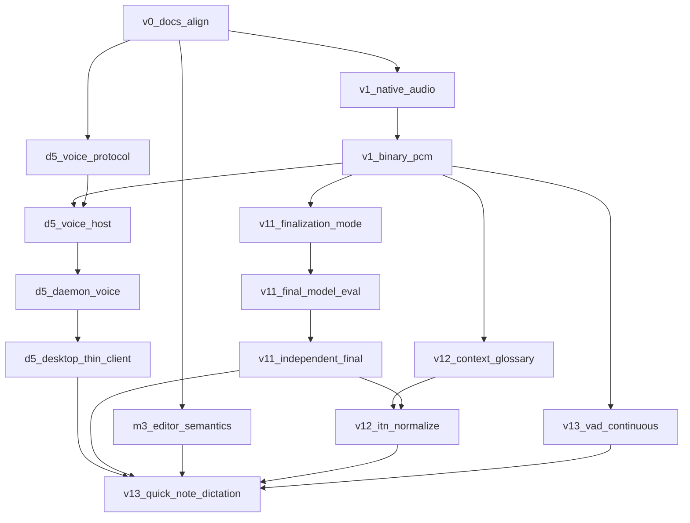

# Voice + Quick Note + D5 Sprint

## Problem / end state

With daemon + hybrid search on `feat/daemon-and-hybrid-search`, the next dangling product surface is voice quality and Quick Note dictation.

**Done when:**

- Mic capture is native (`AVAudioEngine` + `AVAudioConverter`); no JSON `number[]` PCM through Tauri.
- Pre-roll, timestamps, bounded ring, and gap events work.
- `FinalizationMode` is honest; committed text can use an independent final model (TDT v2 candidate) after measurement.
- Session glossary/context is populated; deterministic ITN/path normalization runs before editor commit.
- `latticed` owns voice session/model policy; Tauri is a thin client; `lattice-voice-host` mirrors embed-host isolation.
- Quick Note window supports hold-to-dictate → provisional → final → atomic note (M5), without claiming background residency beyond D7’s keep-running preference.
- Editor M3 basics: one-transaction final, undo-safe, cancel/doc-switch sane.

**Out of scope:** Login-item / menu-bar helper; Linux/Windows providers; replacing FluidAudio wholesale before V1.1 benchmarks.

## Defaults (locked)

| Decision | Choice |
|---|---|
| BASE | `feat/daemon-and-hybrid-search` @ `714b898` (stack on daemon work) |
| Integration branch | `feat/voice-d5-quick-note` |
| Models for subagents | `cursor-grok-4.5-high` (architecture / host / daemon) · `composer-2.5` (routine/tests/docs) |
| Isolation | `best-of-n-runner` worktrees; merge into integration after review |
| Final model | Benchmark first; default keep Unified streaming for provisional; adopt TDT v2 for final only if eval wins |
| Quick Note voice | Requires D5 merged before “ship” claim; UI can spike earlier but residency goes through daemon |
| Capture ownership | Trusted desktop native client owns mic — not WebView |

## Current state (leverage)

- M2 in-process PTT + provisional decorations work (`apps/desktop/src/lib/voice.ts`, `voice.rs`, `lattice-voice-macos`).
- Text Quick Note + global shortcut already exist — no mic.
- Daemon + embed-host supervision pattern: `apps/daemon/src/embed_host.rs`.
- Voice protocol types exist but are unused by daemon (`crates/lattice-voice`).
- Misleading `offline_final_decode: true` while Swift only calls streaming `finish()`.

## DAG overview

## Waves

1. `v0_docs_align`
2. `v1_native_audio` ‖ `m3_editor_semantics` ‖ `d5_voice_protocol`
3. `v1_binary_pcm`
4. `v11_finalization_mode` ‖ `v12_context_glossary` ‖ `d5_voice_host`
5. `v11_final_model_eval` ‖ `d5_daemon_voice`
6. `v11_independent_final` ‖ `v12_itn_normalize` ‖ `d5_desktop_thin_client`
7. `v13_vad_continuous` → `v13_quick_note_dictation`

## Tasks

| ID | Outcome | Model |
|---|---|---|
| v0_docs_align | Roadmap/ADR align: native capture, FinalizationMode, D5 | composer-2.5 |
| v1_native_audio | `lattice-audio` + macOS AVAudioEngine/Converter + pre-roll | grok |
| v1_binary_pcm | Binary PCM, timestamps, bounded queue; retire WebView DSP | grok |
| m3_editor_semantics | One-transaction final, undo, cancel/doc-switch | composer-2.5 |
| v11_finalization_mode | Honest FinalizationMode; fix offline capability lie | composer-2.5 |
| v11_final_model_eval | `research/voice-eval` harness (flush / TDT v2 / Unified offline) | grok |
| v11_independent_final | Utterance buffer + selected final model path | grok |
| v12_context_glossary | VoiceContextBuilder + SessionContext | composer-2.5 |
| v12_itn_normalize | ITN / path / identifier normalizer + provenance | composer-2.5 |
| d5_voice_protocol | Voice envelopes on daemon UDS | grok |
| d5_voice_host | `apps/voice-host-macos` (embed-host analogue) | grok |
| d5_daemon_voice | `latticed` voice_host supervisor + sessions | grok |
| d5_desktop_thin_client | Tauri voice.rs → daemon client | grok |
| v13_vad_continuous | VAD/EOU endpoint policy | grok |
| v13_quick_note_dictation | Hold-to-dictate Quick Note → atomic note | composer-2.5 |

## Explicit non-goals

- Login item / always-on Quick Note with app fully quit
- Shipping Core ML embedding backend
- Cloud ASR
- Reworking search/daemon foundations already landed
