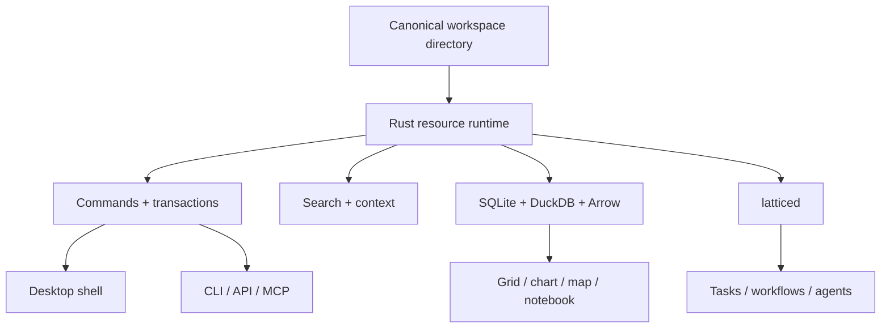

# Product overview

Lattice is a fast local-first workspace for documents, data applications,
analytical datasets, notebooks, canvases, automation, and software. Canonical
content remains ordinary files and open packages in a real directory.

## What this build demonstrates

| Capability | Current demonstration |
| --- | --- |
| Pages | Markdown editing, links, embeds, Mermaid, search and quick capture |
| Canvas | JSON Canvas navigation with page, data-view and interface nodes |
| Data applications | SQLite tables, typed fields, relations, formulas, rollups, views, forms, actions and interfaces |
| Analytical datasets | Workspace-local Hive Parquet queried with DuckDB |
| Transport | Bounded Arrow IPC into Perspective, Vega-Lite and MapLibre |
| Notebooks | Jupyter resources through Pyodide or a native kernel |
| Automation | Tasks, workflows, proposals, approval, logs and derived resources |
| External agents | CLI, local API, daemon and MCP proposal paths |
| Voice | Local capture and finalization through `latticed` |

## Honest boundaries

- Dataset queries are local and bounded; remote R2/S3 sources and streaming
  Arrow record batches are not presented as shipped.
- Maps use plain longitude/latitude points with an offline style; full
  GeoParquet geometry and spatial joins remain later work.
- The GitHub connected-root path is read-only and requires explicit
  authentication. Issues, pull requests, and writeback remain future connector
  depth unless the active build says otherwise.
- Presentation bookmarks, `.show` resources, and connected publishing are not
  yet the native presentation product. This fixture uses an ordered canvas.
- The embedded agent and cloud backend are experimental surfaces. Canonical
  automation still uses semantic commands and governed proposals.

## Architecture

See [[Engineering/Architecture]] and [[Research/Local Runtime]] for the deeper
runtime diagrams.
