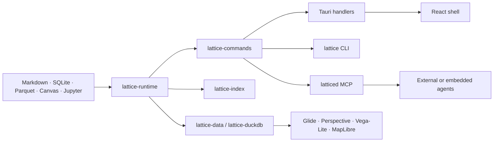

# Engineering architecture

Lattice separates canonical content, semantic mutation, specialized rendering,
and optional long-lived services.

The frontend coordinates lifecycle and intent. Rust owns canonical resource
state, validation, storage, commands, search, data orchestration, and capability
enforcement.

Related material:

- [[Docs/Product Overview]]
- [[Research/Architecture]]
- [[Research/Local Runtime]]
- [[Product/Principles]]
