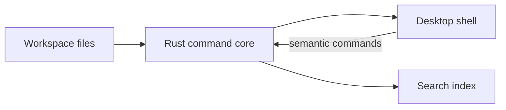
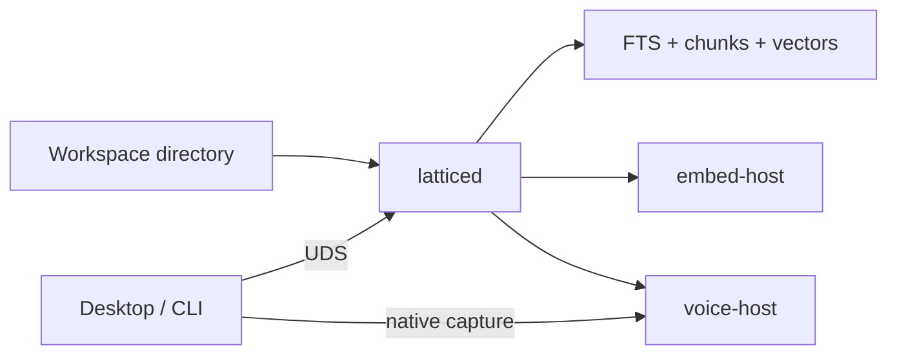

# Architecture

Lattice keeps the workspace honest: files on disk stay canonical; Rust owns
mutations; the shell never becomes a privileged writer.

## Core loop

## With latticed (warm local runtime)

Details and try-paths: [[Research/Local Runtime]].

Related: [[Product/Vision]] and [[Home]].
