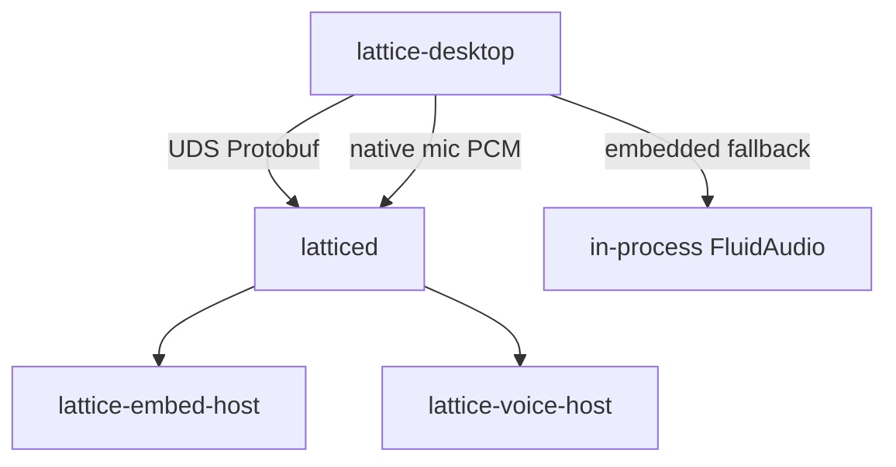

# Local Runtime

How Lattice keeps authority local after the daemon + voice sprints. Everything
below is a real directory on disk — `latticed` is optional warmth, not a cloud.

## Process model

| Process | Owns |
| --- | --- |
| **Desktop** | UI, mic capture, page/canvas hot loops |
| **latticed** | Workspace sessions, search jobs, voice session policy, one-writer lease |
| **embed-host** | Embedding model isolation (fake or llama stub today) |
| **voice-host** | ASR isolation (fake UDS or FluidAudio) |

Dev tip: `pnpm tauri:dev:voice-daemon` / `LATTICE_VOICE_DAEMON=1` forces the thin
daemon path. Default `desktop-dev` still allows `voice-embedded` fallback.

## Search

**⌘K** hits a hybrid index:

1. **Lexical** — FTS5 over structural chunks (headings, paths, body spans)
2. **Semantic** — optional embedding namespace when a provider is warm
3. **Fusion** — RRF merge with provenance (chunk offsets, heading path)

Try queries that hit this page: `latticed`, `EndpointDetected`,
`VoiceContextBuilder`, or `CRM.data/views/Board`.

Glossary-friendly tokens for dictation ITN demos:

- Identifiers: `VoiceContextBuilder`, `FinalizationMode`, `EndpointOptions`
- Paths: `/Users/shared/lattice/CRM.data`, `Inbox/Sample capture.md`
- Commands: `ApplyPageUpdate`, `StartVoiceSession`

## Voice & Quick Note

| Surface | How |
| --- | --- |
| In-page hold-to-talk | Microphone control in the page header |
| Quick Note | **⌘N** → hold-to-dictate → provisional ghost → one save |
| Continuous (opt-in) | `LATTICE_VOICE_AUTO_FINALIZE_ON_ENDPOINT=1` or session endpoint options |

Provisional text never enters Markdown storage. Finals go through the command
core (one editor transaction / one Quick Note save). Cancel clears ghosts.

Hold-to-talk still uses explicit finish; Lattice energy VAD reports
`endpoint_detection` for continuous mode — Unified FluidAudio has no EOU
callback.

## Related

- [[Research/Architecture]] — simpler core diagram
- [[Product/Release Notes]] — what shipped in this sample
- [[Home]] — full tour checklist
- `CRM.data` — data application package beside this narrative

Back to [[Home]].
