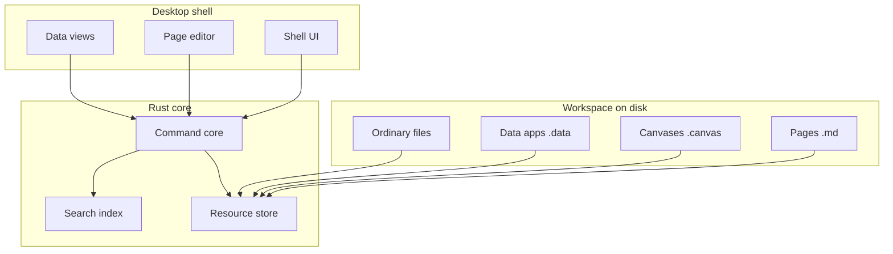
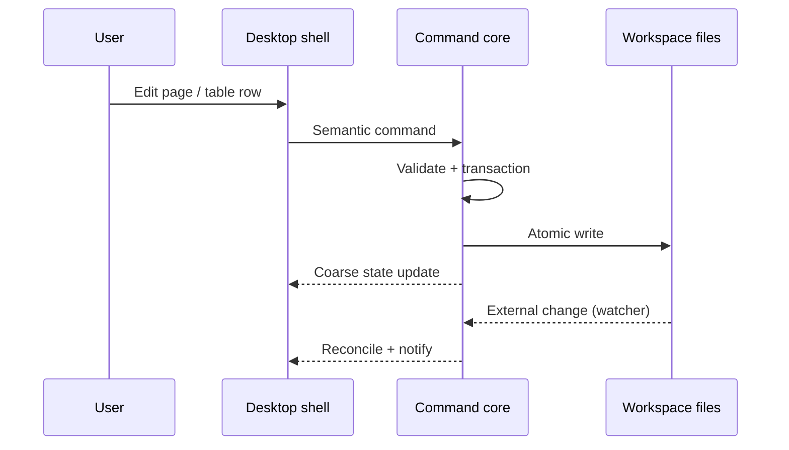
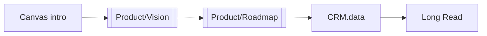

# Long Read

A deliberately long page for scroll, virtualization, and search-index stress tests.
Skim the table of contents, follow wiki links, and open embedded resources without
leaving the narrative.

## Table of contents

1. [[#Why this page exists]]
2. [[#System map]]
3. [[#Data flow]]
4. [[#Collaboration model]]
5. [[#Search and indexing]]
6. [[#Canvas composition]]
7. [[#CRM in context]]
8. [[#Release rhythm]]
9. [[#Interview themes]]
10. [[#Competitive landscape]]
11. [[#Principles in practice]]
12. [[#Embedded resource]]
13. [[#Appendix A — glossary]]
14. [[#Appendix B — checklist]]

## Why this page exists

Daily dogfooding needs realistic volume: headings, lists, tables, code fences,
Mermaid diagrams, and cross-links that mirror how teams actually write. This page
ties together [[Product/Vision]], [[Product/Principles]], [[Product/Roadmap]], and
[[Research/Architecture]] so perf work catches regressions in real reading paths.

Related notes: [[Research/Market Notes]], [[Research/Interview Synthesis]],
[[Research/Competitor Analysis]], and the quick capture in [[Inbox/Sample capture]].

## System map

Lattice keeps the workspace directory authoritative. The desktop shell coordinates;
Rust owns commands, validation, and storage.



## Data flow

External edits and Lattice mutations must reconcile honestly. Nothing in the UI
becomes a privileged writer.



See `Resources/queries.sql` for example read patterns against tabular data.

## Collaboration model

Pages accumulate block-level identity over time. Wiki links like [[Home]] and
[[Product/Release Notes]] stay readable in any Markdown tool. Canvas nodes can
anchor back to blocks once IDs are assigned.

| Concern | Lattice stance |
| --- | --- |
| Canonical storage | Real files and folders |
| Offline | Default, not exceptional |
| Rich tables | `.data` packages beside pages |
| Deep tooling | Inspect surfaces per resource |

## Search and indexing

⌘K should find this page by title, tags, and body text. Repeated keywords below
exercise index tokenization without nonsense padding.

- workspace workspace workspace
- canvas canvas canvas
- sqlite sqlite sqlite
- mermaid mermaid mermaid
- embed embed embed

Long paragraphs also matter: teams paste meeting notes, specs, and interview
transcripts that run thousands of words. Scroll performance should stay stable
when the caret moves from the first heading through nested lists, tables, and
fenced code blocks.

## Canvas composition

Open [[Canvases/Product Strategy.canvas]] and double-click file nodes. The board
links [[Product/Vision]] to [[Product/Roadmap]] spatially — a different reading
order than this linear page.



## CRM in context

`CRM.data` ships ~20 sample contacts with email, company, due dates, status, and
notes. Open the data app from [[Home]] or search for a name like **Grace Hopper**.

In the data app header, switch layouts (grid, list, board, gallery, calendar, form)
from the view picker. Saved views live under `CRM.data/views/` as YAML files — the
First Look template seeds rows only; add views manually or duplicate from
[[Home#CRM views]].

## Release rhythm

Cross-link to [[Product/Release Notes]] for a changelog-style page. Roadmap themes
from [[Product/Roadmap]] should stay aligned with principles in [[Product/Principles]].

1. Instrument perf budgets before adding shell weight.
2. Keep browser demo honest about filesystem authority.
3. Prefer bounded queries over hydrating entire workspaces.

## Interview themes

[[Research/Interview Synthesis]] summarizes recurring quotes. [[Research/Market Notes]]
tracks segments and pricing assumptions. Together they inform [[Research/Competitor Analysis]].

> "I want Notion-like tables without giving up my git repo."
>
> "Canvas is for spatial thinking, not replacing the outline."

## Competitive landscape

| Product | Strength | Tradeoff |
| --- | --- | --- |
| Obsidian | Local Markdown | Weak relational data |
| Notion | Polished blocks | Export friction |
| Airtable | Typed columns | Cloud-centric |
| Lattice | Files + commands | Young surface area |

#research #product #strategy

## Principles in practice

From [[Product/Principles]]:

- **Local-first** — edits work on a plane without Wi‑Fi.
- **Inspectable** — `Resources/` holds JSON, YAML, TypeScript, and SVG you can diff.
- **Progressive disclosure** — Page, Canvas, Table, Notebook, File as primary vocabulary.

```typescript
// Resources/example.ts — tiny module referenced from docs
export function greet(name: string): string {
  return `Hello, ${name}`;
}
```

## Embedded resource

The block below embeds [[Product/Vision]] inline. In read mode it renders a preview
card; activate it to open the full page.

:::lattice-embed
resource: ../Product/Vision.md
fallback: "[[Product/Vision]]"
:::

## Appendix A — glossary

| Term | Meaning |
| --- | --- |
| Data app | `.data` directory with SQLite + manifest |
| Command | Validated mutation through Rust core |
| Canvas | Spatial `.canvas` JSON graph |
| View | YAML layout over a table (`views/*.yaml`) |

## Appendix B — checklist

Use this list when benchmarking scroll and typing on this page:

- [ ] Scroll from top to bottom without layout thrash
- [ ] Collapse and expand a long section mentally — caret stable
- [ ] Follow five wiki links and return via history
- [ ] Render all Mermaid blocks
- [ ] Open the lattice-embed card
- [ ] Search for "Grace Hopper" and jump to CRM

---

Back to [[Home]]. Architecture diagram: [[Research/Architecture]].
