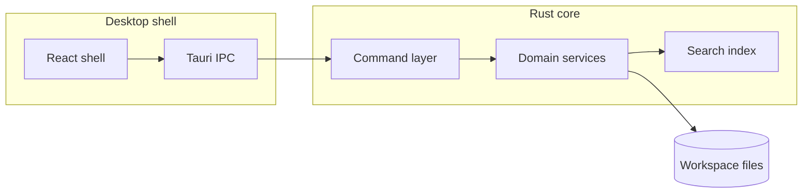

# Component map

High-level request flow for a typical Lattice feature.

## Related

- Spatial layout: [[Architecture/System Overview.canvas]]
- Decision log: [[Decisions/0001-record-architecture-decisions]]
- Open issues: `Issues.data`
